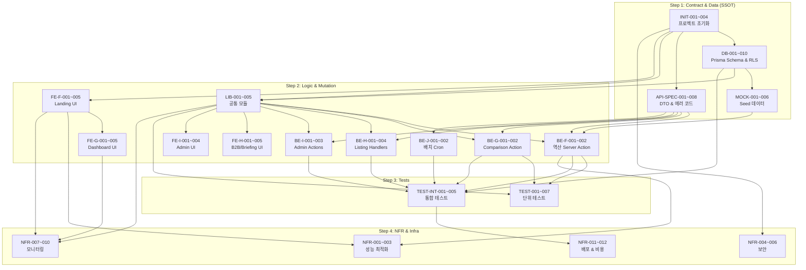

# TASK 목록 명세서

**Source Document**: SRS-004 v1.0 (`07_SRS_v1.0.md`)  
**Date**: 2026-04-18  
**Author**: Technical Project Manager & System Architect  
**Methodology**: Contract-First → CQRS Split → AC-to-Test → NFR Extraction

---

## 목차

1. [Step 1. 계약·데이터 명세 Task (Contract & Data)](#step-1-계약데이터-명세-task)
2. [Step 2. 로직·상태 변경 Task (Logic & Mutation)](#step-2-로직상태-변경-task)
3. [Step 3. 테스트 Task (AC → Test Code)](#step-3-테스트-task)
4. [Step 4. 비기능·인프라 Task (NFR & DevOps)](#step-4-비기능인프라-task)
5. [종합 의존성 그래프](#종합-의존성-그래프)

---

## Step 1. 계약·데이터 명세 Task

> SRS §6.2 Entity & Data Model, §6.1 API Endpoint List, §3.3 API Overview 기반.  
> **목적**: AI 에이전트가 참조할 단일 진실 공급원(SSOT)을 먼저 확립한다.

### Epic A: 프로젝트 초기화 & 스캐폴딩

| Task ID | Epic | Feature (기능명) | 관련 SRS 섹션 | 선행 태스크 | 복잡도 |
|---|---|---|---|---|---|
| INIT-001 | Project Setup | Next.js App Router 프로젝트 초기화 (Tailwind CSS + shadcn/ui + Prisma 세팅) | §1.2.3 C-TEC-001~004 | None | M |
| INIT-002 | Project Setup | Route Group 디렉토리 구조 생성: `/(b2c)`, `/(b2b)`, `/(admin)` + 레이아웃 파일 | §3.2 CLI-01~03 | INIT-001 | L |
| INIT-003 | Project Setup | 환경 변수(.env) 스키마 정의: `DATABASE_URL`, `SECRET_B2B`, `SECRET_ADMIN`, `SLACK_WEBHOOK_URL`, `MOLIT_API_KEY` | §1.2.3 C-TEC-009, §6.5 | INIT-001 | L |
| INIT-004 | Project Setup | Vercel 프로젝트 생성 및 Git Push 자동 배포 파이프라인 연결 | §1.2.3 C-TEC-007, §6.10.1 | INIT-001 | L |

### Epic B: 데이터베이스 스키마 & 마이그레이션

| Task ID | Epic | Feature (기능명) | 관련 SRS 섹션 | 선행 태스크 | 복잡도 |
|---|---|---|---|---|---|
| DB-001 | Database | Prisma Schema 작성: `User` 테이블 (user_id, role ENUM, available_cash, interested_regions, loan_preference, timestamps) | §6.2.1 | INIT-001 | L |
| DB-002 | Database | Prisma Schema 작성: `Zone` 테이블 (zone_id, name, district, stage ENUM 8단계, total_units, estimated_ratio, avg_rights_value, lat/lng 참고용, data_source, last_synced_at, timestamps) | §6.2.2 | INIT-001 | M |
| DB-003 | Database | Prisma Schema 작성: `Listing` 테이블 (listing_id, FK→Zone, FK→User, property_type ENUM, asking_price, actual_investment, premium, rights_value, is_verified, verified_at, owner_contact, unit_number, status ENUM, timestamps). **RLS 대상 필드 주석 명시** | §6.2.3 | DB-001, DB-002 | M |
| DB-004 | Database | Prisma Schema 작성: `Curated_Actual_Price_DB` 테이블 (curated_id, district, price_tier, apartment_name, latest_actual_price, peak_price_2122, recovery_rate, area_sqm, FK→User ADMIN, updated_at) | §6.2.4 | DB-001 | M |
| DB-005 | Database | Prisma Schema 작성: `Bluechip_Reference_Price` 테이블 (bluechip_id, FK→Zone, apartment_name, district 텍스트 매칭 기준, distance_km 참고용, area_sqm, actual_price, updated_at) | §6.2.5 | DB-002 | M |
| DB-006 | Database | Prisma Schema 작성: `LTV_Policy` 테이블 (policy_id, tier_label, price_threshold_min/max, max_loan_amount, effective_from, FK→User ADMIN, updated_at) | §6.2.6 | DB-001 | L |
| DB-007 | Database | Prisma Schema 작성: `Lead_Alert_Subscription` 테이블 (subscription_id, FK→User, budget, target_regions, status ENUM, created_at) | §6.2.7 | DB-001 | L |
| DB-008 | Database | Prisma Schema 작성: `B2B_Partner` 테이블 (partner_id, FK→User, business_license_no UNIQUE, partner_name, coverage_zones, is_active, timestamps) | §6.2.8 | DB-001 | L |
| DB-009 | Database | Prisma 마이그레이션 실행 (로컬 SQLite + Supabase PostgreSQL 동기 확인) 및 ERD 자동 생성 검증 | §6.2.9 ERD, §1.2.3 C-TEC-003 | DB-001~008 | M |
| DB-010 | Database | Supabase RLS 정책 설정: `Listing.owner_contact`, `Listing.unit_number` 필드에 대해 B2B 등록자(agent_id) 본인 및 Admin만 원본 조회 가능하도록 Policy 생성 | §6.2.3, §4.2.3 REQ-NF-010, C-TEC-010 | DB-009 | H |

### Epic C: API 통신 계약 (DTO & 에러 코드 정의)

| Task ID | Epic | Feature (기능명) | 관련 SRS 섹션 | 선행 태스크 | 복잡도 |
|---|---|---|---|---|---|
| API-SPEC-001 | API Contract | API-01 `reverse-filter` Server Action 입출력 DTO 정의 (TypeScript 타입 + Zod 스키마). Input: `{ cash: number, options? }`, Output: `{ zones[], total_count, data_synced_at }` | §6.1 API-01 | INIT-001 | M |
| API-SPEC-002 | API Contract | API-02 `/api/v1/b2b/listing` Route Handler Request/Response DTO 정의 (POST/PUT). Request: `{ zone_id, property_type, asking_price, premium, rights_value, passcode }`, Response: `{ listing_id, is_verified, created_at }`. **에러 코드: 400(검증 실패), 401(패스코드 불일치)** | §6.1 API-02 | INIT-001 | M |
| API-SPEC-003 | API Contract | API-03/04 `comparison` Server Action 입출력 DTO 정의. Dashboard Input: `{ zone_id, cash }`, Dashboard Output: `{ redevelopment, existing_apartments[], district_expanded }`. Report Input: `{ zone_id, apt_ids[], cash }`, Report Output: `{ report{}, generated_at }` | §6.1 API-03/04 | INIT-001 | M |
| API-SPEC-004 | API Contract | API-05 `/api/v1/zones` GET Route Handler Query Params & Response DTO 정의. Params: `page, size, stage`. Response: `{ zones[], pagination }` | §6.1 API-05 | INIT-001 | L |
| API-SPEC-005 | API Contract | API-06 `/api/v1/listings` GET Route Handler Query Params & Response DTO 정의. Params: `zone_id, verified_first, page`. Response: `{ listings[], pagination }` | §6.1 API-06 | INIT-001 | L |
| API-SPEC-006 | API Contract | API-07 `admin` Server Action 입출력 DTO 정의. Input: `{ tier_1_max, tier_2_max, tier_3_max, thresholds, passcode }`, Output: `{ updated, effective_at }`. **에러 코드: 401(Admin 패스코드 불일치)** | §6.1 API-07 | INIT-001 | L |
| API-SPEC-007 | API Contract | API-08 `lead` Server Action 입출력 DTO 정의. Input: `{ user_id, budget, regions? }`, Output: `{ subscription_id, status }` | §6.1 API-08 | INIT-001 | L |
| API-SPEC-008 | API Contract | API-09 `/api/cron/batch-molit` Route Handler Input/Output 정의. Vercel Cron 트리거 기반. Output: `{ items[], synced_count, status }`. **에러 처리: 재시도 3회 후 Slack 경고** | §6.1 API-09 | INIT-001 | M |

### Epic D: Mock 데이터 & 초기 Seed

| Task ID | Epic | Feature (기능명) | 관련 SRS 섹션 | 선행 태스크 | 복잡도 |
|---|---|---|---|---|---|
| MOCK-001 | Mock Data | 초기 Seed 데이터 CSV 작성: 서울 주요 50개 구역(Zone) 정보 + 사업 단계·비례율·권리가액 | §6.7.2 Rollout, CON-02 | DB-002 | M |
| MOCK-002 | Mock Data | 초기 Seed 데이터 CSV 작성: Curated_Actual_Price_DB 구별·금액대별 대표 아파트 30건 이상 (district, price_tier, latest_actual_price, peak_price_2122, recovery_rate) | §6.2.4, §6.7.2 | DB-004 | M |
| MOCK-003 | Mock Data | 초기 Seed 데이터 CSV 작성: Bluechip_Reference_Price 신축 대장 단지 20건 이상 (district 기반 매칭 데이터) | §6.2.5, §6.7.2 | DB-005 | M |
| MOCK-004 | Mock Data | 초기 Seed 데이터: LTV_Policy 3개 Tier 기본값 삽입 (15억 이하→6억, 15~25억→4억, 25억 초과→2억) | §6.2.6, REQ-FUNC-006 | DB-006 | L |
| MOCK-005 | Mock Data | 초기 Seed 데이터: B2B_Partner 테스트 중개사 2곳 + 테스트 Listing 5건 (Verified/일반 혼합) | §6.2.8, §6.2.3 | DB-008, DB-003 | L |
| MOCK-006 | Mock Data | Prisma Seed 스크립트(`prisma/seed.ts`) 작성: 위 CSV → DB 일괄 적재 자동화 | §6.7.2 | MOCK-001~005 | M |

---

## Step 2. 로직·상태 변경 Task

> SRS §4.1 Functional Requirements + §3.6/§6.3 Sequence Diagrams 기반.  
> **CQRS 분리**: Read(Query)는 DB 읽기만, Write(Command)는 DB 상태 변경 포함.

### Epic E: 공통 모듈 (Shared Libs)

| Task ID | Epic | Feature (기능명) | 관련 SRS 섹션 | 선행 태스크 | 복잡도 |
|---|---|---|---|---|---|
| LIB-001 | Shared Lib | `lib/ltv-policy.ts` 구현: `getPolicies()` (DB 조회), `getMaxLoanAmount(price)` (Tier별 최대 대출액 산출) | §6.9 LtvPolicyLib | DB-006, API-SPEC-001 | M |
| LIB-002 | Shared Lib | `lib/tax-calculator.ts` 구현: `calculateAcquisitionTax(price, isRedevelopment)` (취득세 산출 로직) | §6.9 TaxCalcLib | INIT-001 | M |
| LIB-003 | Shared Lib | `components/passcode-guard.tsx` 구현: `verifyPasscode(input, envKey)` (환경 변수 대조), `renderGate(children)` (통과 시 children 렌더, 실패 시 Disabled + 안내) | §6.9 PasscodeGuard, C-TEC-009 | INIT-001 | M |
| LIB-004 | Shared Lib | `lib/masking.ts` 구현: `maskPhoneNumber('01012345678') → '010-****-5678'`, `maskUnitNumber('101-1201') → '***-****'` | §6.9 MaskingUtil, C-TEC-010 | INIT-001 | L |
| LIB-005 | Shared Lib | `lib/slack-webhook.ts` 구현: Slack #dev-alert 채널로 JSON 페이로드 전송 유틸 함수 | §3.1 EXT-05, REQ-NF-014 | INIT-003 | L |

### Epic F: 기능 ①④ 역방향 필터 & 랜딩 UX

| Task ID | Epic | Feature (기능명) | 관련 SRS 섹션 | 선행 태스크 | 복잡도 |
|---|---|---|---|---|---|
| **Read (Query) Tasks** | | | | | |
| FE-F-001 | B2C Landing | [UI] `/(b2c)/page.tsx` 랜딩 페이지 RSC: 화면 중앙 단일 가용 현금 입력창 (shadcn/ui Input + 한국 원화 포맷팅) | REQ-FUNC-001, REQ-NF-003 | INIT-002, LIB-001 | M |
| FE-F-002 | B2C Landing | [UI] `/(b2c)/search/page.tsx` 역산 결과 리스트 렌더링 컴포넌트: 구역 카드 목록 (zone_name, estimated_investment_range, match_score) + Pagination | REQ-FUNC-002, REQ-NF-002 | FE-F-001 | M |
| FE-F-003 | B2C Landing | [UI] 매칭 0건 시 빈 상태(Empty State) 안내 UI + Lead Gen 버튼 컴포넌트 | REQ-FUNC-004 | FE-F-002 | L |
| FE-F-004 | B2C Landing | [UI] 데이터 동기화 지연 안내 배너 컴포넌트: `last_synced_at` 30일 초과 시 상단 배너 노출 로직 | REQ-FUNC-005 | FE-F-002 | L |
| FE-F-005 | B2C Landing | [UI] Layout Component 하단 면책 조항 고정 노출: "본 데이터는 국토부 실거래가 및 동일 행정구 기준이며, 현장 호가와 다를 수 있습니다" | REQ-FUNC-020, CON-05 | INIT-002 | L |
| **Write (Command) Tasks** | | | | | |
| BE-F-001 | Reverse Filter | [Server Action] `app/actions/reverse-filter.ts` 구현: (1) LTV 정책 조회 → (2) 취득세 산출 → (3) 이주비 대출 역산 → (4) 필요 총투자금 ≤ 가용 현금 필터링 → (5) Zone/Listing 매칭 결과 반환 **(DB Read Only, 상태 변경 없음)** | REQ-FUNC-002, REQ-FUNC-003, REQ-FUNC-006, §6.3.1 | LIB-001, LIB-002, DB-009, API-SPEC-001 | H |
| BE-F-002 | Lead Gen | [Server Action] `app/actions/lead.ts` 구현: Lead_Alert_Subscription 레코드 생성 **(DB Write: INSERT)** | REQ-FUNC-007, §6.3.1 | DB-007, API-SPEC-007 | L |

### Epic G: 기능 ② 1:1 대조 대시보드

| Task ID | Epic | Feature (기능명) | 관련 SRS 섹션 | 선행 태스크 | 복잡도 |
|---|---|---|---|---|---|
| **Read (Query) Tasks** | | | | | |
| FE-G-001 | B2C Dashboard | [UI] `/(b2c)/comparison/[zoneId]/page.tsx` 대시보드 레이아웃: 좌측 재개발 구역 정보 + 우측 기축 아파트 3개 카드 (회복률% 표시) | REQ-FUNC-008, REQ-FUNC-010, §6.3.2 | FE-F-002 | H |
| FE-G-002 | B2C Dashboard | [UI] 인접 행정구 확장 매칭 툴팁 컴포넌트: `district_expanded === true` 시 "동일 행정구 내 데이터 부재, 인접 행정구 기준 산정" | REQ-FUNC-012 | FE-G-001 | L |
| FE-G-003 | B2C Dashboard | [UI] LTV 미달 시 안내 메시지 + shadcn/ui Slider 예산 슬라이더 UI 컴포넌트 | REQ-FUNC-013 | FE-G-001 | M |
| FE-G-004 | B2C Dashboard | [UI] 비교군 커스텀 편집: shadcn/ui Dialog 내 아파트 검색 + 비교 대상 변경 UI | REQ-FUNC-014 | FE-G-001 | M |
| FE-G-005 | B2C Dashboard | [UI] 심층 분석 리포트 비교표 렌더링 컴포넌트: 투자 구조·주거 비용·현금 흐름·미래 가치 4개 섹션 테이블 (RSC Streaming) | REQ-FUNC-011, REQ-NF-004 | FE-G-001 | H |
| **Write (Command) Tasks — 실질적으로는 복합 Read** | | | | | |
| BE-G-001 | Comparison | [Server Action] `app/actions/comparison.ts` - `generateDashboard()`: (1) LTV 정책 + 최대 매수 금액 산출 → (2) Curated DB 구별 실거래가 매칭 (기축 3개+) → (3) `WHERE district = zone.district` 텍스트 매칭으로 Bluechip Reference 조회 → (4) 동일 행정구 부재 시 `WHERE district IN (인접 목록)` 확장 → (5) 전고점 회복률 산출 → (6) `district_expanded` 플래그 반환 **(DB Read Only)** | REQ-FUNC-008, 009, 010, 012, §6.3.2 | LIB-001, DB-004, DB-005, API-SPEC-003 | H |
| BE-G-002 | Comparison | [Server Action] `app/actions/comparison.ts` - `generateReport()`: (1) 투자 구조 분석 → (2) 주거 비용 산출 → (3) 현금 흐름 시뮬레이션 → (4) 미래 가치 비교 **(DB Read Only, 연산 집중)** | REQ-FUNC-011, §6.3.2 | BE-G-001, API-SPEC-003 | H |

### Epic H: 기능 ③ B2B Verified 매물 & 브리핑

| Task ID | Epic | Feature (기능명) | 관련 SRS 섹션 | 선행 태스크 | 복잡도 |
|---|---|---|---|---|---|
| **Read (Query) Tasks** | | | | | |
| FE-H-001 | B2B Listing | [UI] `/(b2b)/listing/new/page.tsx` 매물 등록 폼 (shadcn/ui Form + Zod 클라이언트 검증): zone_id, property_type, asking_price, premium, rights_value, owner_contact, unit_number | REQ-FUNC-015, §6.3.3 | INIT-002, LIB-003 | M |
| FE-H-002 | B2B Listing | [UI] 매물 등록 에러 상태 렌더링: 호가 이상치 시 입력 필드 하단 붉은색 에러 메시지 ("정상 범위를 벗어난 호가입니다") | REQ-FUNC-018 | FE-H-001 | L |
| FE-H-003 | B2B Listing | [UI] 패스코드 불일치 시 입력 폼 전체 Disabled + "유효하지 않은 접근 코드입니다" 안내 | REQ-FUNC-019 | LIB-003, FE-H-001 | L |
| FE-H-004 | B2C Listing | [UI] `/(b2c)/listings/page.tsx` B2C 매물 리스트: Verified 뱃지 매물 상단 우선 고정 노출 + 민감 정보 비노출 | REQ-FUNC-016 | INIT-002 | M |
| FE-H-005 | B2B Briefing | [UI] `/(b2b)/briefing/[zoneId]/page.tsx` 고객 브리핑 모드: 민감 정보 UI 마스킹(`010-****-1234`) + 시뮬레이션 데이터 100% 가시성 | REQ-FUNC-017, C-TEC-010 | LIB-003, LIB-004 | M |
| **Write (Command) Tasks** | | | | | |
| BE-H-001 | B2B Listing | [Route Handler] `/api/v1/b2b/listing` POST 구현: (1) 패스코드 검증 → (2) Zod 서버 검증 → (3) 주변 실거래가 조회 → (4) 오차율 ±30% 교차검증 → (5) 검증 통과 시 Prisma INSERT (is_verified=true, 평문 저장) → (6) 실패 시 400 반환 **(DB Write: INSERT)** | REQ-FUNC-015, 018, §6.3.3 | DB-003, LIB-003, API-SPEC-002 | H |
| BE-H-002 | B2B Listing | [Route Handler] `/api/v1/b2b/listing/[id]` PUT 구현: (1) 패스코드 검증 → (2) 매물 수정 → (3) 재교차검증 → (4) Prisma UPDATE **(DB Write: UPDATE)** | REQ-FUNC-015, §6.1 API-02 PUT | BE-H-001 | M |
| **Read (Query) Handlers** | | | | | |
| BE-H-003 | Listings API | [Route Handler] `/api/v1/listings` GET 구현: Prisma 쿼리 `orderBy: [{ is_verified: 'desc' }]` + Pagination + zone_id 필터 **(DB Read Only)** | REQ-FUNC-016, §6.1 API-06 | DB-003, API-SPEC-005 | M |
| BE-H-004 | Zones API | [Route Handler] `/api/v1/zones` GET 구현: Prisma 쿼리 + stage 필터 + Pagination **(DB Read Only)** | §6.1 API-05 | DB-002, API-SPEC-004 | M |

### Epic I: Admin 패널 & 정책 관리

| Task ID | Epic | Feature (기능명) | 관련 SRS 섹션 | 선행 태스크 | 복잡도 |
|---|---|---|---|---|---|
| **Read (Query) Tasks** | | | | | |
| FE-I-001 | Admin | [UI] `/(admin)/page.tsx` Admin 대시보드 레이아웃 + PasscodeGuard 래핑 | §3.2 CLI-03, §6.5 MODE-04 | LIB-003, INIT-002 | M |
| FE-I-002 | Admin | [UI] `/(admin)/ltv-policy/page.tsx` LTV 정책 변수 관리 폼: 3 Tier 편집 (shadcn/ui Table + Form) | REQ-FUNC-006, REQ-NF-016 | FE-I-001 | M |
| FE-I-003 | Admin | [UI] `/(admin)/curated-db/page.tsx` Curated DB 관리 인터페이스: 구별 대표 아파트 CRUD 목록 | REQ-NF-017 | FE-I-001 | M |
| FE-I-004 | Admin | [UI] `/(admin)/partners/page.tsx` B2B 파트너 관리: 중개사 목록 + 활성/비활성 토글 | §6.5 MODE-04, UC-12 | FE-I-001 | M |
| **Write (Command) Tasks** | | | | | |
| BE-I-001 | Admin | [Server Action] `app/actions/admin.ts` - `updateLtvPolicy()`: Admin 패스코드 검증 → LTV_Policy 테이블 UPDATE **(DB Write: UPDATE)** | REQ-FUNC-006, REQ-NF-016, §6.1 API-07 | DB-006, LIB-003, API-SPEC-006 | M |
| BE-I-002 | Admin | [Server Action] `app/actions/admin.ts` - `updateCuratedDb()`: Admin 패스코드 검증 → Curated_Actual_Price_DB UPSERT **(DB Write: UPSERT)** | REQ-NF-017 | DB-004, LIB-003 | M |
| BE-I-003 | Admin | [Server Action] `app/actions/admin.ts` - `managePartner()`: Admin 패스코드 검증 → B2B_Partner is_active 토글 **(DB Write: UPDATE)** | UC-12, §6.2.8 | DB-008, LIB-003 | L |

### Epic J: 데이터 파이프라인 (배치 수집 & 수동 업로드)

| Task ID | Epic | Feature (기능명) | 관련 SRS 섹션 | 선행 태스크 | 복잡도 |
|---|---|---|---|---|---|
| BE-J-001 | Data Pipeline | [Route Handler Cron] `/api/cron/batch-molit` GET 구현: (1) 국토부 API 호출 → (2) 10초 타임아웃 제어 → (3) 데이터 Prisma Upsert + last_synced_at 갱신 → (4) 실패 시 3회 재시도 → (5) 전부 실패 시 Slack Webhook 경고 발송 **(DB Write: UPSERT)** | REQ-NF-018, §6.3.4, CON-04 | DB-002, LIB-005, API-SPEC-008 | H |
| BE-J-002 | Data Pipeline | `vercel.json` Cron 스케줄 설정: `/api/cron/batch-molit` 일 1회 트리거 | §6.3.4, §6.10.1 | BE-J-001 | L |

---

## Step 3. 테스트 Task

> SRS §6.8 Requirements Verification Methods + §4.1~4.2 AC(Given/When/Then) 기반.  
> **목적**: 에이전트가 "이 테스트가 통과할 때까지 로직을 수정하라"는 피드백 루프를 형성한다.

### Epic K: 단위 테스트 (Unit Tests)

| Task ID | Epic | Feature (기능명) | 관련 SRS 섹션 | 선행 태스크 | 복잡도 |
|---|---|---|---|---|---|
| TEST-001 | Unit Test | `lib/tax-calculator.ts` 단위 테스트: (1) 일반 아파트 취득세 정확도 (2) 재개발 매물 취득세 정확도 (3) 경계값(0원, 음수) 예외 처리 | REQ-FUNC-003, TC-FUNC-003 | LIB-002 | M |
| TEST-002 | Unit Test | `lib/ltv-policy.ts` 단위 테스트: (1) 15억 이하 → 6억 반환 (2) 15~25억 → 4억 반환 (3) 25억 초과 → 2억 반환 (4) 경계값(정확히 15억, 25억) | REQ-FUNC-006, TC-FUNC-006 | LIB-001 | M |
| TEST-003 | Unit Test | `lib/masking.ts` 단위 테스트: (1) `maskPhoneNumber('01012345678') === '010-****-5678'` (2) `maskUnitNumber('101-1201') === '***-****'` (3) null/undefined 입력 시 빈 문자열 | REQ-FUNC-017, TC-FUNC-017 | LIB-004 | L |
| TEST-004 | Unit Test | `components/passcode-guard.tsx` 단위 테스트: (1) 올바른 패스코드 → children 렌더링 (2) 잘못된 패스코드 → Disabled 상태 + 안내 메시지 (3) 빈 입력 → 거부 | REQ-FUNC-019, TC-FUNC-019 | LIB-003 | M |
| TEST-005 | Unit Test | `reverse-filter.ts` Server Action 단위 테스트: (1) 현금 3억 입력 → 매칭 구역 1건 이상 반환 (2) 현금 5천만 원 → 0건 + empty 배열 (3) 오차율 ±5% 이내 검증 (4) `data_synced_at` 포함 확인 | REQ-FUNC-002~005, TC-FUNC-002~005 | BE-F-001, MOCK-006 | H |
| TEST-006 | Unit Test | `comparison.ts` - `generateDashboard()` 단위 테스트: (1) 동일 행정구 내 Bluechip 존재 시 `district_expanded === false` (2) 동일 행정구 부재 시 인접 확장 + `district_expanded === true` (3) 기축 3개 이상 반환 (4) 회복률 산출 정확도 | REQ-FUNC-008~010, 012, TC-FUNC-008~012 | BE-G-001, MOCK-006 | H |
| TEST-007 | Unit Test | `comparison.ts` - `generateReport()` 단위 테스트: (1) 투자 구조 섹션 데이터 존재 (2) 현금 흐름 섹션 데이터 존재 (3) 미래 가치 섹션 데이터 존재 (4) 응답 시간 < 500ms | REQ-FUNC-011, TC-FUNC-011 | BE-G-002 | M |

### Epic L: 통합 테스트 (Integration Tests)

| Task ID | Epic | Feature (기능명) | 관련 SRS 섹션 | 선행 태스크 | 복잡도 |
|---|---|---|---|---|---|
| TEST-INT-001 | Integration | B2B 매물 등록 E2E 플로우: (1) 패스코드 일치 → 폼 활성화 (2) 정상 범위 매물 입력 → 201 Created + is_verified=true (3) ±30% 초과 이상치 → 400 Bad Request + 에러 메시지 (4) 패스코드 불일치 → 폼 Disabled + 안내 | REQ-FUNC-015, 018, 019, TC-FUNC-015/018/019 | BE-H-001, LIB-003 | H |
| TEST-INT-002 | Integration | 역방향 필터 → 대시보드 → 리포트 E2E 플로우: (1) 현금 3억 입력 → 매칭 결과 표시 (2) 구역 선택 → 대시보드 렌더링 (3) 리포트 생성 → 비교표 표시 | REQ-FUNC-001→002→008→011 | BE-F-001, BE-G-001, BE-G-002 | H |
| TEST-INT-003 | Integration | 국토부 API 배치 + Fallback 통합 테스트: (1) Mock API 정상 응답 → DB Upsert 성공 (2) Mock API 타임아웃 주입 → 3회 재시도 → Slack 경고 (3) Fallback 상태에서 역산 실행 → 기존 데이터 + 안내 배너 | REQ-NF-007, 018, TC-NF-007/018 | BE-J-001, BE-F-001 | H |
| TEST-INT-004 | Integration | Admin LTV 정책 변경 → 역산 반영 E2E: (1) Admin 패널에서 Tier 1 최대 대출액 수정 → DB UPDATE (2) B2C 역산 검색 실행 → 변경된 정책으로 결과 산출 | REQ-FUNC-006, TC-FUNC-006 | BE-I-001, BE-F-001 | M |
| TEST-INT-005 | Integration | RLS 보안 통합 테스트: (1) B2C 역할로 Listing.owner_contact 조회 시도 → 접근 불가 확인 (2) B2B agent_id 일치 시 → 원본 조회 가능 (3) Admin → 전체 접근 가능 | REQ-NF-010, TC-NF-010 | DB-010 | H |

---

## Step 4. 비기능·인프라 Task

> SRS §4.2 Non-Functional Requirements + §6.10 Infrastructure Cost Design 기반.

### Epic M: 성능 & 최적화

| Task ID | Epic | Feature (기능명) | 관련 SRS 섹션 | 선행 태스크 | 복잡도 |
|---|---|---|---|---|---|
| NFR-001 | Performance | Vercel Serverless Function Cold Start 대응: `reverse-filter.ts`를 Edge Runtime 또는 Warm-up 요청으로 구성 | REQ-NF-001, RISK-05 | BE-F-001 | M |
| NFR-002 | Performance | Zone/Listing 리스트 Pagination 구현: `/(b2c)/search` 결과 및 `/api/v1/zones`, `/api/v1/listings`에 cursor 기반 또는 offset Pagination 적용 | REQ-NF-002 | BE-H-003, BE-H-004, FE-F-002 | M |
| NFR-003 | Performance | 랜딩 페이지 LCP ≤ 1초: RSC SSR 최적화 + 불필요한 Client JS 번들 제거 확인 (Lighthouse 측정) | REQ-NF-003, TC-NF-003 | FE-F-001 | M |

### Epic N: 보안 & 접근 제어

| Task ID | Epic | Feature (기능명) | 관련 SRS 섹션 | 선행 태스크 | 복잡도 |
|---|---|---|---|---|---|
| NFR-004 | Security | Vercel Firewall 룰 설정: 알려진 크롤링 봇 User-Agent 차단 + Rate Limiting | REQ-NF-011 | INIT-004 | M |
| NFR-005 | Security | Cloudflare DNS + Free WAF 설정: DDoS 방어 + 봇 차단 룰 활성화 | REQ-NF-011 | INIT-004 | M |
| NFR-006 | Security | HTTPS/TLS 확인: Vercel 도메인 자동 HTTPS 활성화 + TLS 1.2 미만 비활성화 검증 | REQ-NF-013, TC-NF-013 | INIT-004 | L |

### Epic O: 모니터링 & 알림

| Task ID | Epic | Feature (기능명) | 관련 SRS 섹션 | 선행 태스크 | 복잡도 |
|---|---|---|---|---|---|
| NFR-007 | Monitoring | Amplitude SDK 초기화: `/(b2c)` 레이아웃에 SDK 삽입 + `View_Landing_Page`, `Input_Cash_Amount`, `View_Filtered_Result_List` 이벤트 트래킹 코드 | §3.1 EXT-03, REQ-NF-022 | FE-F-001, FE-F-002 | M |
| NFR-008 | Monitoring | Amplitude 퍼널 이벤트 추가: `Enter_1vs1_Dashboard`, `Leave_1vs1_Dashboard` (체류 시간 계측), `Click_Verified_Listing`, `Impression_All_Listings` | REQ-NF-023, REQ-NF-024 | FE-G-001, FE-H-004 | M |
| NFR-009 | Monitoring | Slack Webhook 에러 알림 통합: (1) `reverse-filter.ts` p90 Latency 2.0초 초과 → Slack 경고 (2) 배치 수집 실패 → Slack 경고 | REQ-NF-014, REQ-NF-018 | LIB-005, BE-F-001, BE-J-001 | M |
| NFR-010 | Monitoring | Vercel Analytics 활성화 확인: Web Vitals 자동 수집 + 대시보드 접근 확인 | §3.1 EXT-04, REQ-NF-028 | INIT-004 | L |

### Epic P: 배포 & 비용 관리

| Task ID | Epic | Feature (기능명) | 관련 SRS 섹션 | 선행 태스크 | 복잡도 |
|---|---|---|---|---|---|
| NFR-011 | Deployment | Production 배포 체크리스트: (1) 환경 변수 Vercel 대시보드 설정 확인 (2) Prisma 마이그레이션 → Supabase 실행 (3) Seed 데이터 적재 (4) Cron 스케줄 활성화 (5) Preview 환경 E2E 사전 검증 | §6.7.2 Rollout, §6.10 | 전 Task 완료 | M |
| NFR-012 | Cost Mgmt | 비용 임계점 모니터링 설정: (1) Supabase DB 용량 400MB 알림 (2) Amplitude 이벤트 8만/월 도달 시 알림 (3) Vercel Function Invocations 50% 소진 시 알림 | §6.10.3 | INIT-004 | L |

---

## 종합 의존성 그래프



---

## 태스크 통계 요약

| Step | Epic | 태스크 수 |
|---|---|---|
| **Step 1** Contract & Data | A: 프로젝트 초기화 | 4 |
| | B: DB 스키마 | 10 |
| | C: API 계약 | 8 |
| | D: Mock/Seed | 6 |
| **Step 2** Logic & Mutation | E: 공통 모듈 | 5 |
| | F: 역산 & 랜딩 | 7 |
| | G: 대시보드 | 7 |
| | H: B2B 매물 & 브리핑 | 9 |
| | I: Admin 패널 | 7 |
| | J: 배치 파이프라인 | 2 |
| **Step 3** Tests | K: 단위 테스트 | 7 |
| | L: 통합 테스트 | 5 |
| **Step 4** NFR & Infra | M: 성능 | 3 |
| | N: 보안 | 3 |
| | O: 모니터링 | 4 |
| | P: 배포 & 비용 | 2 |
| **합계** | **16 Epics** | **89 Tasks** |

---

### Critical Path (최단 경로)

> 아래 경로가 프로젝트 전체 일정에 직접적 영향을 미치는 **핵심 병목**입니다.

```
INIT-001 → DB-001~009 → MOCK-001~006 → LIB-001+002 → BE-F-001 → TEST-005 → FE-F-001~002 → BE-G-001 → FE-G-001 → TEST-INT-002 → NFR-011
```

**Sprint 1 목표 (Milestone 1)**: `INIT` → `DB` → `MOCK` → `LIB` → `BE-F-001` → `FE-F-001~005` → `TEST-005`  
**Sprint 2 목표 (Milestone 2)**: `BE-G` → `FE-G` → `BE-H` → `FE-H` → `BE-I` → `FE-I` → `TEST-INT-001~005` → `NFR` → `DEPLOY`

---

*End of TASK Specification*  
**Source**: SRS-004 v1.0 (Document ID: SRS-004)  
**Generated by**: Technical Project Manager & System Architect
