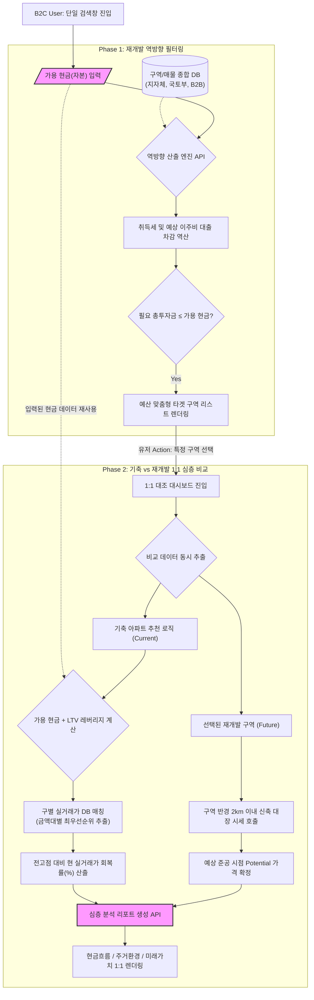

# 재개발 의사결정 Navigator PRD (v0.3 통합)

- Owner 팀: Product Team
- 최종 업데이트: 2026-05-02

## 0. 제품 정의
투자금(예산) 맞춤 재개발 투자 플랫폼.
내 예산을 입력하면 진입 가능한 구역을 비교 분석해주고, 파트너 중개사의 verified 매물을 연결해줍니다. 동일 예산으로 재개발 구역 vs 기축 아파트 비교 분석 기능도 갖춤.

## 1. 개요·목표

- **문제 정의(Pain 지표 포함)**:
현재 재개발 예비 투자자들은 방대한 구역 정보를 엑셀로 일일이 정리하며 극심한 **시간 부족**을 겪고 있습니다(엑셀 수작업 구역 탐색 시간 주당 15시간 초과). 또한, 정보 비대칭과 허위 매물로 인한 오프라인 헛걸음 비율이 60% 이상에 달하며, 정비사업 특유의 분담금 변동 등 비정형 리스크를 객관적으로 비교하지 못해 투자 결정을 내리지 못하는 **결정 장애**(의사결정 지연율 80% 이상)를 겪고 있습니다. B2B 파트너인 공인중개사 역시 **아날로그 영업 방식**으로 인해 2030 세대 진성 리드 전환율이 10% 미만에 머물고 있습니다.
- **목표(Desired Outcome 수치화)**:
정보 탐색 시간 90% 단축(주 15시간 → 1.5시간 이내) 및 허위매물로 인한 오프라인 헛걸음 제로화(0%). B2B 중개사의 진성 매수자 브리핑 성공률 3배 상승.
- **성공 지표(북극성/보조 KPI 및 측정 경로)**:
    - **북극성 KPI**: 가용 현금 쿼리(Query) 검색 완료율 (초기 랜딩 후 실제 필터링 결과를 확인하는 비율)
        - Baseline: 0% → Target: 65% (측정 주기: 주간)
        - **측정 경로**: Amplitude 퍼널 분석 (`View_Landing_Page` 이벤트 → `Input_Cash_Amount` 이벤트 → `View_Filtered_Result_List` 이벤트 도달률)
    - **보조 KPI 1**: Verified(검증) 뱃지 매물 클릭 전환율 (CTR)
        - Baseline: 0% → Target: 40% (측정 주기: 주간)
        - **측정 경로**: Mixpanel 또는 GA4 (`Click_Verified_Listing` 이벤트 수 / `Impression_All_Listings` 노출 수)
    - **보조 KPI 2**: 1:1 대조 대시보드 체류 시간
        - Baseline: 0초 → Target: 평균 3분 이상 (측정 주기: 월간)
        - **측정 경로**: 클라이언트 세션 타이머 기반 (`Enter_1vs1_Dashboard` ~ `Leave_1vs1_Dashboard` 간의 Time on Page 평균치)

## 2. 사용자와 페르소나

- **김민수 (38, 코어-스마트 비기너)**: 본업이 바빠 파편화된 구역 정보를 엑셀로 정리하는 데 지침. 내 자산(현금)에 맞는 역방향 필터링 니즈. (여정 Pain: 무의미한 광역 탐색 반복)
- **이지혜 (34, 코어-스마트 비기너)**: 찌라시와 허위 매물에 지쳐 오프라인 임장 전 정보 신뢰성에 강한 불신. 실투자금 오차 없는 '진짜' 매물 확인 니즈. (여정 Pain: 헛걸음 및 현장 호가 변동)
- **정아름 (32, 코어-스마트 비기너)**: 기축 아파트(갭투자)와 재개발 사이의 ROI 및 분담금 폭탄 리스크를 대조할 툴 부재. (여정 Pain: 비정형 리스크로 인한 의사결정 마비)
- **박성호 (52, 코어-B2B 파트너)**: 아날로그 방식(종이/네이버 부동산) 브리핑으로 인해 젊은 세대 영업 타율 저하 및 플랫폼 주도권 상실 우려. (여정 Pain: 정량적 데이터 브리핑 도구 부재)

## 3. 사용자 스토리와 수용 기준(AC, Acceptance Criteria)

### 기능 ① & ④: 가용 현금 단일 검색 랜딩 및 역방향 필터 (김민수 타겟)

- **Story**: As a 바쁜 스마트 비기너, I want 내 가용 현금만 입력하면 진입 가능한 구역을 즉시 역산해 주기를, so that 엑셀 노가다 없이 최적의 투자처를 바로 확정할 수 있다.
- **AC 1**: Given 앱 초기 랜딩 화면에 접속했을 때, When 로딩이 완료되면, Then 복잡한 지도가 아닌 단일 '가용 현금 입력창'이 화면 중앙에 1초 이내로 렌더링되어야 한다.
- **AC 2**: Given 현금 '3억'을 입력하고 검색을 눌렀을 때, When 역산 알고리즘이 실행되면, Then 취득세 및 대출을 고려한 역산 결과 리스트가 1.5초(p95) 이내에 노출되어야 한다.
- **AC 3**: Given 역산된 리스트를 확인할 때, When 구역별 상세 보기 영역을 보면, Then 예상 실투자금 범위의 오차율이 실제 공시/호가 데이터 대비 ±5% 이내로 표기되어야 한다.
- **AC 4 (실패/예외 케이스 - 예산 미달)**: Given 사용자가 가용 현금을 비현실적으로 낮게(예: '5,000만 원' 이하) 입력했을 때, When 역산 필터링 알고리즘 결과 매칭되는 구역이 0개라면, Then 백지 화면이 아닌 "해당 예산으로 진입 가능한 구역이 현재 없습니다"라는 안내와 함께 **'예산 내 매물 출현 시 알림 받기' (Lead Gen) 버튼**이 노출되어야 한다.
- **AC 5 (실패/예외 케이스 - 외부 API 타임아웃)**: Given 사용자가 검색을 실행했을 때, When 국토부 실거래가 오픈 API 또는 지자체 서버 지연으로 3초 이내에 데이터를 받아오지 못하면, Then "최신 데이터를 불러오는 데 시간이 걸리고 있습니다. 이전 캐시 데이터로 먼저 보여드릴까요?"라는 Fallback 안내 팝업을 노출해야 한다.

### 기능 ②: 기축 아파트 vs 재개발 1:1 대조 대시보드 (정아름 타겟)

- **Story**: As a 리스크를 두려워하는 투자자, I want 내 가용 자본으로 살 수 있는 최선의 기축 아파트와 재개발 구역을 비교하기를, so that 실거주 가치와 투자 수익성 사이의 기회비용을 명확히 판단할 수 있다.
- **AC 1 (LTV 기반 매칭)**: Given 사용자의 가용 현금이 '3억'일 때, When 1:1 대조 기능을 실행하면, Then '3억 + LTV 기반 최대 대출액(예: 6억)'인 9억 원대 아파트를 **'구별 최신 실거래가 DB'**에서 우선순위(예: 다산이편한세상자이 등)에 따라 3개 이상 자동 추천해야 한다.
- **AC 2 (미래 가치 및 회복률 산정)**: Given 재개발 구역의 사업 단계가 초기일 때, When 수익성을 시뮬레이션하면, Then **'구역 반경 2km 이내 신축 대장 단지'**의 시세를 미래 Potential 가격으로 상정하고, 비교군인 기축 아파트는 **'21-22년 전고점 대비 현 실거래가 회복률(%)'** 지표를 반드시 표시해야 한다.
- **AC 3 (심층 분석 리포트 출력)**: Given 비교 대상을 확정했을 때, When '리포트 생성'을 누르면, Then 투자 구조, 주거 비용, 현금 흐름, 미래 가치 항목을 포함한 비교표를 0.5초 이내로 렌더링해야 한다.
- **AC 4 (실패/예외 케이스 - 비교군 부재)**: Given 사용자가 선택한 재개발 구역 반경 2km 이내에 '신축 대장 단지(Bluechip)' 데이터가 없을 때, When 미래 잠재 가격(Potential)을 산정하려 하면, Then 시스템은 비교 반경을 **'5km 이내의 동일 행정구'**로 자동 확장하여 매칭하고, 대시보드 UI 상단에 툴팁으로 *"인근 2km 내 데이터 부재로 5km 반경의 대장 단지를 기준으로 산정했습니다"*라는 문구를 명시해야 한다.
- **AC 5 (실패/예외 케이스 - LTV 한도 오류)**: Given 사용자가 1:1 대조를 실행할 때, When 입력한 가용 현금이 해당 지역의 최소 LTV 규제 비율과 합산해도 가장 저렴한 기축 아파트(예: 3억 원) 매수조차 불가능한 금액일 경우, Then "현재 예산으로는 비교 가능한 기축 아파트가 없습니다. 목표 예산을 상향해 시뮬레이션 해보세요"라는 안내와 함께 예산 슬라이더 UI를 띄워야 한다.

### 기능 ③: B2B 검증 매물 연동 - O2O Verified (이지혜/박성호 타겟)

- **Story**: As a 정보 신뢰를 중시하는 매수자(및 중개사), I want 락인된 현지 중개사가 보증하는 매물에 Verified 뱃지가 표시되기를, so that 허위 매물 여부를 의심하지 않고 거래(브리핑)할 수 있다.
- **AC 1**: Given B2B 중개사가 매물 정보를 입력/수정할 때, When 권리가액과 프리미엄(P) 데이터를 기입하면, Then 플랫폼 내 교차검증 로직을 통과한 매물에만 즉시(1초 내) 'Verified 뱃지' DB 상태값이 활성화되어야 한다.
- **AC 2**: Given B2C 유저가 매물 리스트를 스크롤할 때, When Verified 뱃지가 달린 매물이 존재하면, Then 해당 매물은 일반 매물보다 상단에 우선 고정 노출되어야 한다.
- **AC 3**: Given 중개사가 B2B 태블릿 모드로 접속할 때, When 고객 브리핑용 UI를 활성화하면, Then 민감한 공급자 정보(소유주 연락처 등)는 마스킹 처리되고 고객향 시뮬레이션 데이터만 100% 가시성으로 노출되어야 한다.
- **AC 4 (실패/예외 케이스 - 데이터 정합성 오류)**: Given B2B 중개사가 매물 정보를 입력할 때, When 주변 실거래가 대비 오차율이 비정상적인 값(예: 프리미엄 -5억 등 ±30% 범위를 벗어난 이상치)을 입력하고 저장을 시도하면, Then 데이터베이스 저장이 즉각 차단되고, 입력 필드 하단에 붉은색 텍스트로 *"정상 범위를 벗어난 호가입니다. 오타를 확인해 주세요."*라는 에러 메시지가 렌더링되어야 한다.
- **AC 5 (실패/예외 케이스 - 중개사 권한 만료)**: Given B2B 중개사가 매물 등록을 시도할 때, When 해당 중개사의 사업자 인증 또는 파트너십 권한이 만료된 상태라면, Then 입력 폼이 비활성화(Disabled) 처리되고 "파트너십 인증이 만료되었습니다. 관리자에게 문의하세요"라는 모달 창이 노출되어야 한다.

### 기능 ⑤: 구역별 다중 비교 스캐터 차트 (김민수/정아름 타겟)

- **Story**: As a 투자자, I want 내 예산에 맞는 구역들의 사업 진행 단계와 실제 투자금 범위를 한눈에 차트로 비교하기를, so that 어떤 구역이 상대적으로 안전하고 저평가되었는지 직관적으로 파악할 수 있다.
- **AC 1 (Range 시각화 및 색상)**: Given 스캐터 차트가 렌더링될 때, When 구역 데이터가 표시되면, Then X축은 사업 단계(1~8단계), Y축은 예상 실투자금으로 설정되고, 투자금의 위아래 범위(Range)를 보여주는 캡슐 형태로 표시되며 티어별로 색상이 그룹핑(Color Coding)되어야 한다.
- **AC 2 (동적 필터링 및 토글)**: Given 사용자가 예산을 입력한 상태에서, When '검색결과만 / 전체보기' 토글을 조작하면, Then 예산을 초과하는 구역은 Dimmed(반투명) 처리되거나 숨김 처리되어 진입 가능한 구역이 직관적으로 하이라이팅되어야 한다. 기본값은 '검색결과만' 노출이다.
- **AC 3 (Click-to-pin 툴팁)**: Given 차트의 특정 구역에 마우스를 호버하거나 클릭할 때, When 툴팁이 활성화되면, Then 클릭 시 해당 좌표에 툴팁이 고정(Pin)되고, 툴팁 내부에 "[행정구명] 모아보기" 버튼이 제공되어야 한다.
- **AC 4 (행정구 줌인 및 대장 마커)**: Given 사용자가 툴팁의 "[행정구명] 모아보기" 버튼을 클릭할 때, When 차트가 해당 구로 필터링/줌인되면, Then X축 9단계(가상의 완료 단계) 위치에 해당 행정구의 신축 대장 아파트 시세가 보라색 세모(▲) 마커로 표시되어 구역별 프리미엄을 기축과 비교할 수 있어야 한다.

## 4. 기능 요구사항(Functional)

- **우선순위 및 마일스톤 (Sprint 계획)**:
    - **Sprint 1 (Milestone 1 - B2C 코어 가치 검증)**: ① 역방향 필터 알고리즘, ④ 단일 검색창 랜딩 (핵심 가치 개발 집중), ⑤ 구역별 다중 비교 스캐터 차트
    - **Sprint 2 (Milestone 2 - B2B 파이프라인 및 시뮬레이션)**: ② 1:1 대조 대시보드, ③ B2B Verified 매물 연동 파이프라인
    - **Phase 2 (Out of MVP Scope)**: 커뮤니티 및 소유주 전용 행정 서비스 (전자투표 등)
- **차별 가치(Differential Value)**: 기존 아실/리치고 대비 타겟 구역 탐색 속도 **10배 향상**(통상 3시간 → 1.5초), 수작업 엑셀 비교 대비 초기투자금 시세 오차율 **5% 이내로 통제**, 기존 플랫폼 대비 허위 매물 노출률 **0%**(Verified 정책 기반).

### ⚙️ [Mermaid] 핵심 로직: 가용 자산 기반 역방향 필터링 흐름도

## 5. 비기능 요구사항(NFR, Non-Functional Requirement)

- **성능 (Performance)**:
    - **부하 조건**: 동시 접속자(VU) 1,000명 / 초당 트랜잭션(TPS) 500 수준의 부하 테스트(e.g., JMeter, k6) 환경에서 역산 알고리즘 처리 p95 응답 속도 ≤ 1.5초를 유지해야 한다.
    - 대규모 구역 데이터(1,000개 이상) 맵/리스트 교차 로딩 시 Pagination 또는 Lazy Loading 적용하여 초기 로딩 메모리 부하 최소화.
- **신뢰성 (Reliability)**:
    - 시스템 월 가용성 ≥ 99.9%
    - 외부 국토부 API/지자체 고시 데이터 연동 실패 또는 지연 시, 오류율 통제를 위해 최종 캐싱(Cached)된 백업 데이터를 화면에 제공하고 '업데이트 지연(Fallback)' 상태를 UI에 명시.
- **보안/비용 (Security & Cost)**:
    - B2B 현장 매물 데이터(특히 소유주 정보, 동호수 등) 무결성 보호 및 암호화(AES-256). 외부 크롤링 봇 접근 차단 방화벽(WAF) 설정.
- **모니터링 항목 및 알림 (Alerting)**:
    - 역산 엔진 API Latency 모니터링: p90 Latency가 5분 이상 연속으로 2.0초를 초과할 경우 Datadog에서 Slack #dev-alert 채널로 경고 발송.
    - 퍼널 드롭률 알림: `Input_Cash_Amount` → `View_Filtered_Result` 단계의 드롭률이 이전 7일 평균 대비 **15%p 이상 급증(Spike)**할 경우, 즉각 PagerDuty를 통해 담당 PM 및 엔지니어에게 Critical 알림 발송.

## 6. 데이터·인터페이스 개요

- **핵심 엔터티 및 주요 필드**:
    - `User`: 가용 예산(KRW), 관심 지역, 대출 선호 여부
    - `Zone (구역)`: 사업 단계(8단계), 총세대수, 예상 비례율, 평균 권리가액 예상치
    - `Listing (매물)`: 물건 유형(뚜껑, 다세대 등), 실투자금(호가-대출 등), P(프리미엄), `is_verified` (Boolean)
- **외부/내부 API 개요**:
    - 외부 API (Inbound): 국토교통부 실거래가 오픈 API (Rate limit 제약 고려하여 일배치 수집), 지자체 정비사업 고시 크롤러.
    - 내부 API (Outbound/Inbound): `/api/v1/reverse-filter` (현금 입력값 기반 매물 ID 배열 반환), `/api/v1/b2b/listing` (중개사 매물 등록/수정).
- **신규 관리 데이터 (Internal DB)**:
    - **`Curated_Actual_Price_DB`**: 구별/금액대별 대표 아파트 리스트. 호가가 아닌 **최신 실거래가** 기준으로 운영팀이 주 단위 업데이트 (네이버 매물 스크래핑 법적 리스크 회피).
    - **`Bluechip_Reference_Price`**: 각 재개발 구역 인근(2km) 신축 대장주의 평형별 실거래가 데이터.
- **계산 엔진 로직**:
    - **LTV 계산기**: 15억 이하 최대 6억 / 15~25억 최대 4억 / 25억 초과 2억 등 정부 정책 가이드라인을 상수로 관리하여 역산에 반영.

## 7. 범위(In/Out), 리스크·가정·의존성

### 7.1 프로젝트 범위 (Scope)

- **In (Phase 1 MVP)**:
    - ① 초개인화 '가용 자산' 역방향 필터 (LTV 레버리지 반영 알고리즘 포함)
    - ② 일반 기축 아파트 vs 재개발 1:1 대조 대시보드 (구별 실거래가 기반 매칭 및 미래가치 리포트)
    - ③ B2B 검증 '현장 독점 매물' 연동 (Verified 뱃지 시스템)
    - ④ 가용 현금 '단일 노출' 검색창 랜딩 UX
    - ⑤ 구역별 다중 비교 스캐터 차트 (사업단계 vs 실투자금 Range 기반 동적 시각화 및 비교)
- **Out (Phase 2)**:
    - 커뮤니티 및 소유주 전용 행정 서비스 (전자투표 등)

### 7.2 핵심 리스크 및 대응책 (Mitigation)

1. **정책 및 금융 규제 리스크**: LTV/DSR 규제 등 정부의 대출 정책이 급격히 변동될 경우 시스템 매칭 로직 신뢰도 하락 우려.
    - **대응책**: LTV/DSR 산출 로직을 하드코딩하지 않고, 어드민(Admin) 패널에서 전역 변수로 관리자가 즉시 수정 및 배포할 수 있는 시스템 구조(Parameterization)로 설계한다.
2. **데이터 적시성(Lag) 리스크**: 국토부 실거래가는 최대 30일 시차가 존재하여 현장 호가와 갭 발생 가능.
    - **대응책**: 결과 화면에 "*본 데이터는 국토부 실거래가 기준이며, 현장 호가와 다를 수 있습니다*"라는 면책 조항(Disclaimer)을 고정 노출하고, 향후 B2B 중개사 데이터를 통해 호가 갭을 좁히는 로직을 고도화한다.
3. **미래 가치 산정의 주관성**: 시스템이 자동 매칭하는 반경 2km 이내 신축 대장 단지가 유저가 생각하는 비교군과 다를 경우 결과에 대한 불신 발생 가능.
    - **대응책**: 시스템 자동 추천뿐만 아니라, 사용자가 비교 대상인 신축 아파트를 직접 검색하여 변경할 수 있는 '비교군 커스텀 편집 기능'을 대시보드 내에 제공한다.
4. **B2B 공급망 확보 리스크**: 초기 거점 지역 공인중개사(B2B 파트너) 확보가 부진할 경우, 'Verified' 매물 데이터 풀이 부족해져 서비스의 신뢰성 차별화가 약화될 수 있음.
    - **대응책**: 초기 핵심 권역(예: 노량진, 장위 등) 선도 중개사 5곳에 디지털 브리핑 툴 프리미엄 기능을 무상으로 선제공하여 락인(Lock-in)하고 초기 매물 풀을 독점 확보한다.

### 7.3 가정 및 의존성 (Assumptions & Dependencies)

- **데이터 의존성**: 국토부 실거래 API 및 지자체 정비사업 고시 데이터의 정상적인 호출에 100% 의존합니다.
- **사용자 행동 가정**: 스마트 비기너 유저는 불법 소지가 있는 '네이버 매물 크롤링 호가'보다, 운영팀이 검증하여 주 단위로 업데이트하는 '구별 대표 아파트 실거래가 리스트'를 더 신뢰할 것이라고 가정합니다.
- **대체재 가설**: 재개발 초기 구역의 불확실성을 '주변 신축 시세'라는 구체적 실체로 치환해 주는 것이 유저의 의사결정 확신을 높이는 데 기여할 것입니다.

### 7.4 핵심 아키텍처 결정 기록 (ADR)

- **결정 사항 1 (역산 처리 위치)**: 사용자의 가용 현금을 기반으로 한 역산(취득세, 대출 산정 등) 로직은 프론트엔드가 아닌 **백엔드(Server-side)에서 처리**한다.
    - **결정 사유**: 세법 변경이나 대출 규제 변동 시 클라이언트 앱 스토어 업데이트(심사 대기) 없이 서버 측 배포만으로 즉각적인 시장 상황 반영이 가능하도록 유연성을 확보하기 위함이다.
- **결정 사항 2 (비교군 DB 관리 방식)**: 기축 아파트 비교군 데이터는 자동 크롤링이 아닌 **수동/반자동(Curated DB) 큐레이션 방식**을 택한다.
    - **결정 사유**: 무분별한 네이버 부동산 크롤링에 따른 법적 분쟁 및 IP 차단 리스크를 원천 제거하고, 서비스 초기 데이터의 높은 정합성을 유지하여 사용자 신뢰(Moat)를 확보하기 위함이다.

---

## 8. 실험·측정 및 가설 검증 설계

### 8.1 롤아웃 계획 (Rollout)

- **베타 채널**: 시간 빈곤과 정보 비대칭을 겪는 '스마트 비기너' 100명 및 핵심 지역(예: 장위, 노량진 등) 선도 중개사 5곳을 대상으로 클로즈드 베타를 실시합니다.
- **데이터 관리**: 9억대, 12억대 등 각 금액대별 '비교 대상 아파트'는 구별 실거래가를 기반으로 운영팀이 주 1회 수동/반자동 업데이트하여 무결성을 유지합니다.

### 8.2 실험 및 가설 검증 설계 (Proof 연결)

이 프로덕트가 지닌 '차별 가치(대안 대비 10배 빠른 탐색, O2O 해자)'가 유효한지 검증하기 위해 아래와 같이 실험을 설계하고 데이터를 측정합니다.

- **검증 항목 1: 사용자 예산 기반 초개인화 필터링의 탐색 효율성 입증**
    - **가설**: 가용 현금 역방향 랜딩(B안)이 복잡한 지도 탐색(A안)보다 사용자 목적 달성에 걸리는 시간을 90% 단축시키고 이탈률을 낮출 것이다. (또한 복잡한 지도 검색보다 단일 입력 랜딩을 제공했을 때 검색 완료율이 20%p 향상될 것이다)
    - **측정 방법(실험)**: A/B 테스트 (n=100) 및 벤치마크 사용성 테스트(UT).
        - [A 그룹] 아실/호갱노노 앱 사용 / [B 그룹] Navigator 앱 사용
    - **성공 기준(임계치)**: "내 예산(3억)에 맞는 타겟 구역 3곳 도출" 태스크 완료 시간(Task Time) 측정 결과, B그룹이 A그룹 평균 시간(약 3시간) 대비 1.5분 이내로 도달하여 **99% 단축** 시 성공.
    - **Proof (비즈니스 연결)**: 태스크 시간 단축이 검증되면, 타 플랫폼의 멀티호밍 유저들을 독점적으로 락인(Lock-in)할 수 있는 핵심 지불 의사(WTP) 근거로 활용 가능.
- **검증 항목 2: O2O Verified 매물 시스템의 신뢰도 입증**
    - **가설**: 현지 중개사가 보증한 Verified 뱃지가 달린 매물이 일반 매물 대비 사용자 인게이지먼트(CTR) 및 오프라인 문의 전환율이 압도적으로 높을 것이다. (단순 거리 기반보다 LTV를 반영한 매칭 리포트를 제공할 때 리포트 저장/공유율이 30% 이상 높을 것이다)
    - **측정 방법(실험)**: 앱 내 리스트 노출 대비 클릭 이벤트 비율(CTR) 로깅 분석.
    - **성공 기준(임계치)**: 동일 구역 내 일반 매물 CTR(통상 5~10%) 대비, Verified 매물 CTR이 **40% 이상 도달** 시 성공.
    - **Proof (비즈니스 연결)**: Verified 매물의 높은 CTR은 현장 중개사(B2B)들에게 디지털 브리핑 툴을 써야만 하는 이유를 증명하며, 공급자 스위칭 코스트를 높여 거대 플랫폼 대비 완벽한 **데이터 무결성 방어 해자(Moat)**를 증명함.

### 8.3 보조 성공 측정 지표 (Metrics)

*(검증 항목 외 지속 트래킹)*

- **북극성 KPI**: 가용 현금 쿼리 기반 '1:1 비교 분석 리포트' 생성 완료율
- **보조 지표**:
    - **ROI 시뮬레이션 활용도**: 비례율/회복률 토글 조작 횟수 및 체류 시간
    - **B2B 리드 전환**: 'Verified' 매물 확인 후 중개사에게 문의 버튼을 클릭하는 비율

---

## 9. 근거(Proof 요약)

- **기획 근거 리서치 요약**:
압도적 트래픽의 메가 플랫폼(아실 등)은 위치 중심의 개방형 정보에 머물러 있어 사용자 예산 기반의 '초개인화 필터링' 영역이 공백 상태임. 핵심 타겟인 스마트 비기너 집단은 투자 의사결정의 피로도를 낮추기 위해 기꺼이 비용을 지불할 의사(WTP)가 검증된 고관여 집단으로, 1년 차 유료 유저 100명(매출 연 7,560만 원) 확보 목표의 강력한 비치헤드 시장이 됨. 현장 실거래 파이프라인 구축 시 스위칭 코스트를 극대화하는 방어 해자(Moat) 형성 가능.