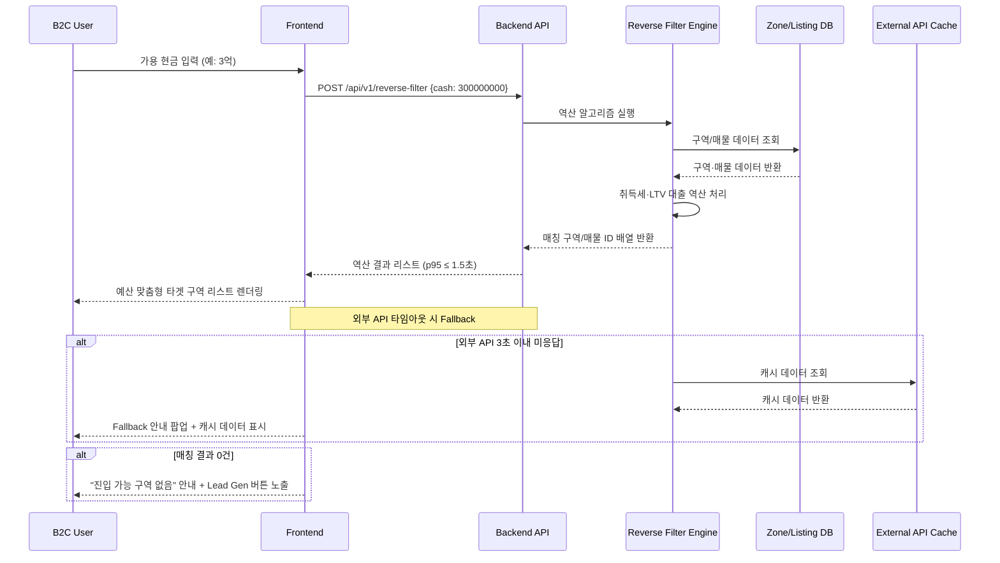
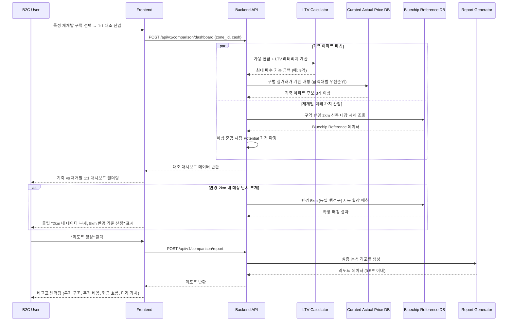
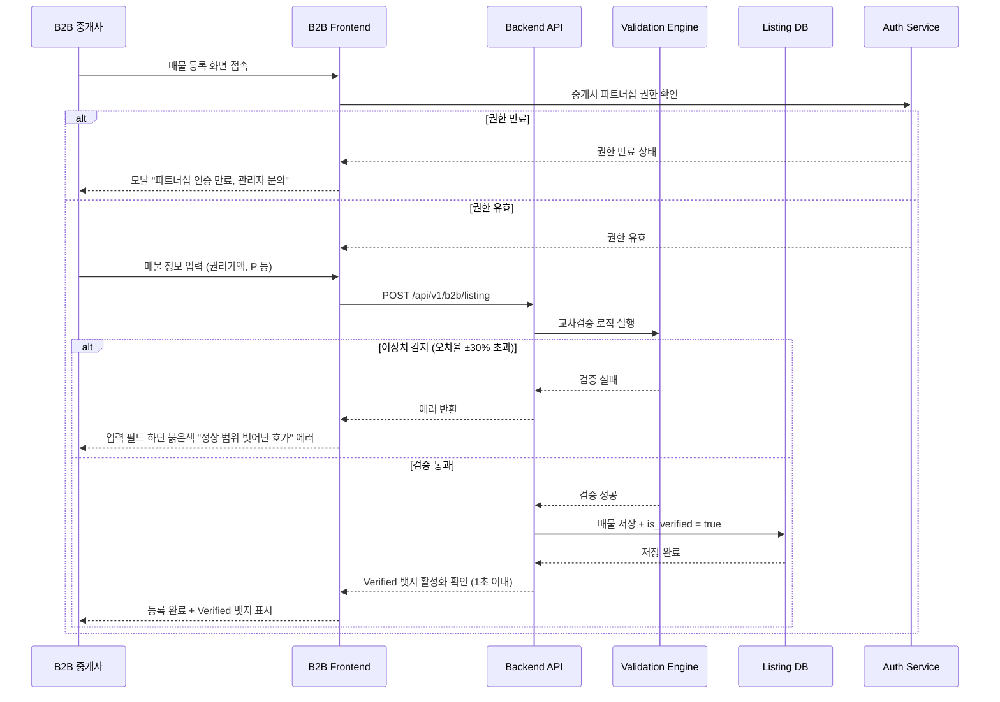
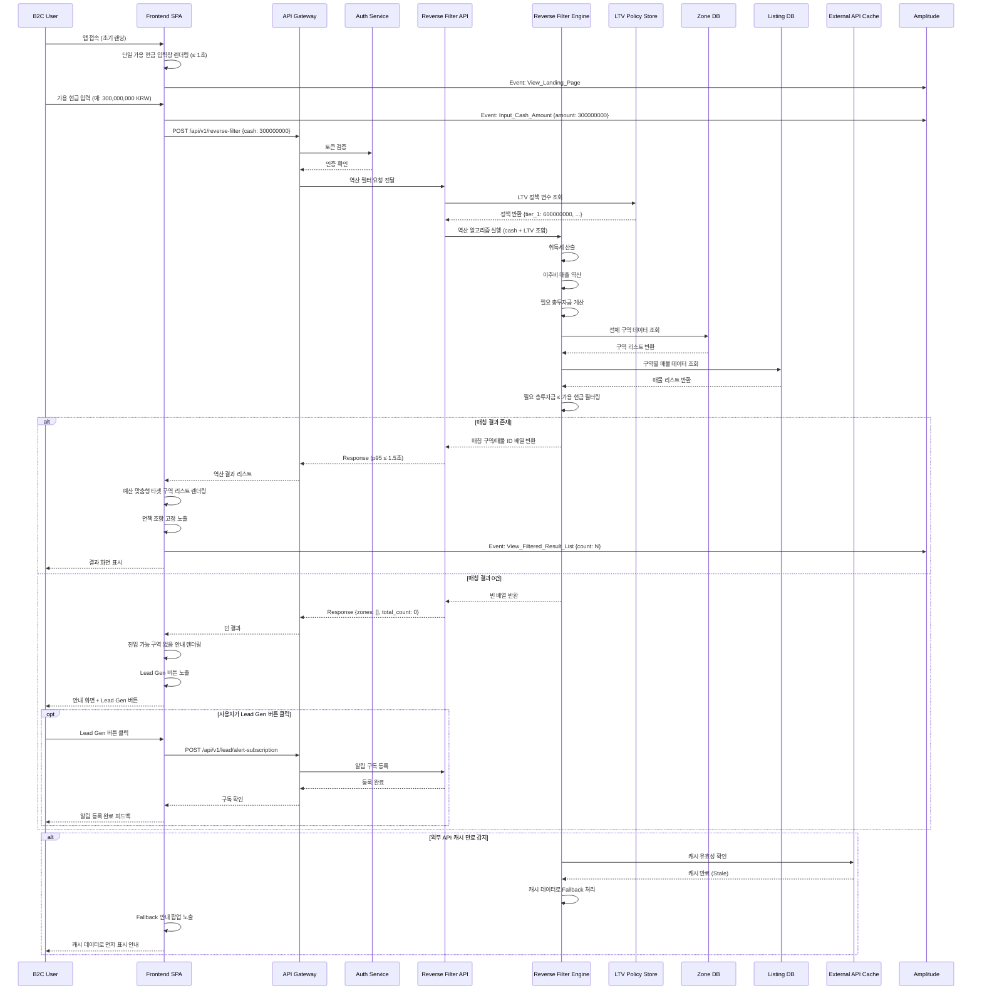
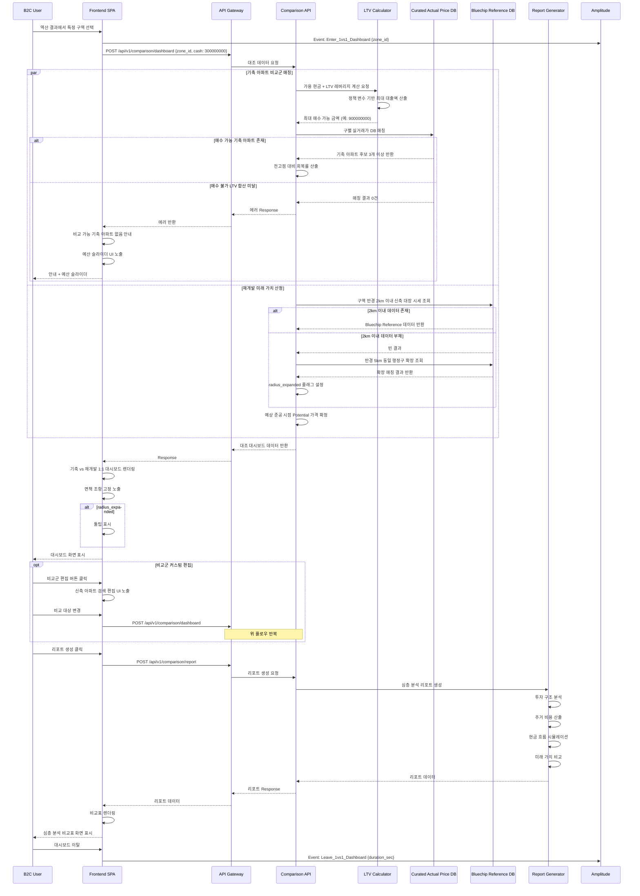
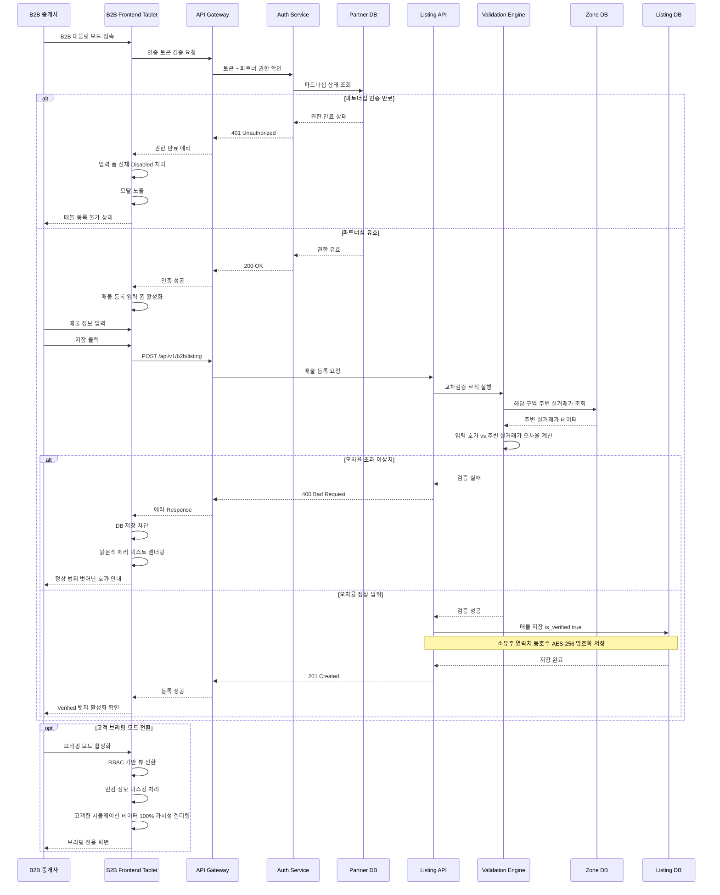
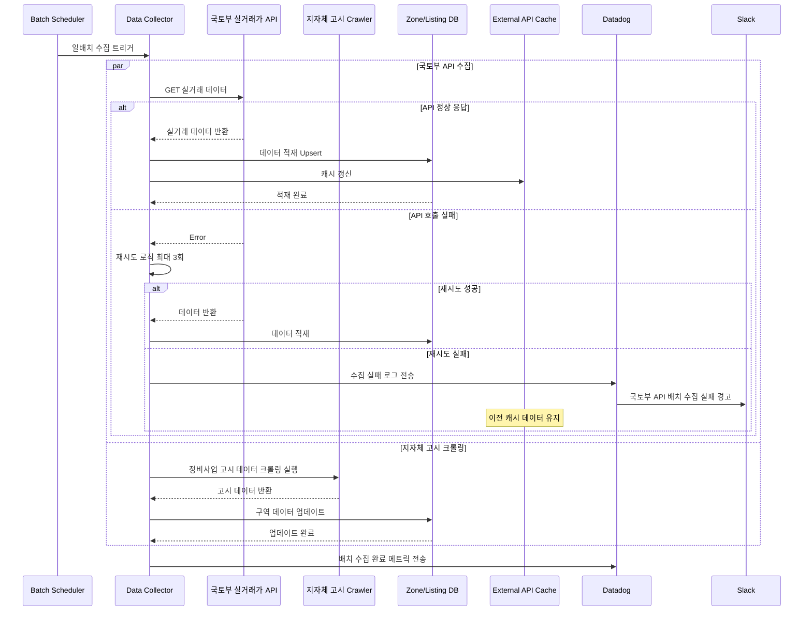
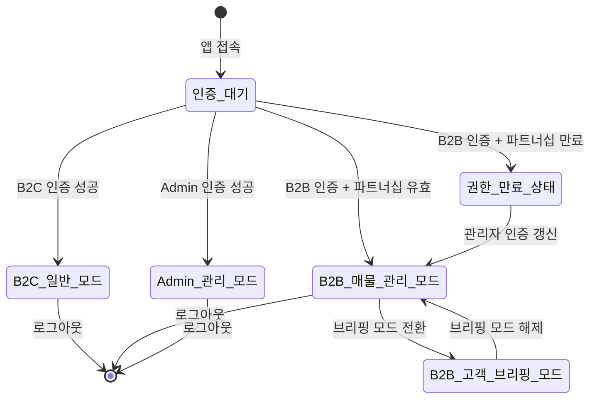

# Software Requirements Specification (SRS)

**Document ID**: SRS-001  
**Revision**: 1.2  
**Date**: 2026-04-25  
**Standard**: ISO/IEC/IEEE 29148:2018  

---

## 1. Introduction

### 1.1 Purpose

본 SRS 문서는 **"씨드핏 (Seed Fit) - 예산 맞춤 투자 분석 플랫폼"** (구. 재개발 의사결정 Navigator) 시스템의 소프트웨어 요구사항을 정의한다. 본 문서의 목적은 다음과 같다:

1. 재개발 예비 투자자가 방대한 구역 정보를 수작업(엑셀)으로 정리하는 데 소요하는 **주당 15시간 이상의 탐색 시간**을 자동화된 역방향 필터링 시스템으로 제거한다.
2. **60% 이상의 오프라인 헛걸음 비율**(허위 매물·정보 비대칭 기인)을 B2B 검증(Verified) 매물 시스템으로 원천 차단한다.
3. **80% 이상의 의사결정 지연율**(비정형 리스크 비교 불가 기인)을 기축 아파트 vs 재개발 1:1 대조 대시보드로 해소한다.
4. B2B 공인중개사의 **2030 세대 진성 리드 전환율 10% 미만** 문제를 디지털 브리핑 도구로 개선한다.

본 문서는 개발팀, QA팀, 프로젝트 관리자, 비즈니스 이해관계자가 시스템의 기능적·비기능적 요구사항을 공통적으로 이해하고 검증하기 위한 단일 원천(Single Source of Truth)으로 사용된다.

### 1.2 Scope

#### 1.2.1 In-Scope (Phase 1 MVP)

| ID | 기능 | 설명 |
|---|---|---|
| SCOPE-IN-01 | ① 역방향 필터 알고리즘 | 가용 현금(초기투자금) 입력 시 취득세·대출을 고려한 역산으로 진입 가능 구역 자동 산출 (프리미엄·전세 세팅 감안) |
| SCOPE-IN-02 | ② 1:1 대조 대시보드 | 기축 아파트 vs 재개발 구역의 투자 구조·현금 흐름·미래 가치 심층 비교 (구별 실거래가 기반 매칭) |
| SCOPE-IN-03 | ③ B2B Verified 매물 연동 | 락인된 현지 중개사 보증 매물에 Verified 뱃지 부여, 교차검증 파이프라인 |
| SCOPE-IN-04 | ④ 단일 검색창 랜딩 UX | 복잡한 지도 탐색 대신 '가용 현금' 단일 입력창 중심 초기 화면 구성 |
| SCOPE-IN-05 | ⑤ 구역별 다중 비교 스캐터 차트 | 사업단계(X축) vs 실투자금(Y축)을 기준으로 Range 캡슐 형태 시각화 및 예산 연동 동적 필터링 제공 |

#### 1.2.2 Out-of-Scope (Phase 2 이후)

| ID | 기능 | 사유 |
|---|---|---|
| SCOPE-OUT-01 | 커뮤니티 및 소유주 전용 행정 서비스 | 전자투표 등 별도 Phase에서 검토 |

#### 1.2.3 Constraints (제약사항)

| ID | 제약사항 | 상세 |
|---|---|---|
| CON-01 | 역산 처리 위치 | 역산(취득세, 대출 산정) 로직은 백엔드(Server-side)에서 처리한다. 세법·대출 규제 변동 시 클라이언트 업데이트 없이 서버 배포만으로 즉각 반영하기 위함이다. (ADR-01) |
| CON-02 | 비교군 DB 관리 방식 | 기축 아파트 비교군 데이터는 자동 크롤링이 아닌 수동/반자동(Curated DB) 큐레이션 방식을 적용한다. 네이버 부동산 크롤링의 법적 리스크 원천 제거 및 초기 데이터 정합성 유지를 위함이다. (ADR-02) |
| CON-03 | LTV 정책 파라미터화 | LTV/DSR 산출 로직을 하드코딩하지 않고 어드민 패널에서 전역 변수로 관리자가 즉시 수정·배포할 수 있는 Parameterization 구조로 설계한다. |
| CON-04 | 외부 API 의존성 | 국토부 실거래 API 및 지자체 정비사업 고시 데이터의 정상 호출에 의존한다. Rate Limit 제약을 고려하여 일배치(Daily Batch) 수집 방식을 적용한다. |
| CON-05 | 데이터 면책 조항 | 결과 화면에 "본 데이터는 국토부 실거래가 기준이며, 현장 호가와 다를 수 있습니다" 면책 조항(Disclaimer)을 고정 노출해야 한다. |

#### 1.2.4 Assumptions (가정)

| ID | 가정 |
|---|---|
| ASM-01 | 스마트 비기너 유저는 네이버 매물 크롤링 호가보다, 운영팀이 검증하여 주 단위로 업데이트하는 구별 대표 아파트 실거래가 리스트를 더 신뢰한다. |
| ASM-02 | 재개발 초기 구역의 불확실성을 '주변 신축 시세'라는 구체적 실체로 치환하면 유저의 의사결정 확신이 향상된다. |
| ASM-03 | 국토부 실거래 API 및 지자체 정비사업 고시 데이터가 정상적으로 호출 가능한 상태를 유지한다. |

### 1.3 Definitions, Acronyms, Abbreviations

| 용어 | 정의 |
|---|---|
| **역방향 필터링 (Reverse Filtering)** | 사용자의 가용 현금을 입력값으로 받아, 취득세·대출 가능액을 역산하여 진입 가능한 재개발 구역을 자동 산출하는 알고리즘 |
| **LTV (Loan-To-Value)** | 담보인정비율. 주택 가격 대비 대출 가능 최대 금액의 비율 |
| **DSR (Debt Service Ratio)** | 총부채원리금상환비율 |
| **Verified 뱃지** | B2B 파트너 중개사가 등록하고 플랫폼 교차검증 로직을 통과한 매물에 부여되는 신뢰성 인증 표시 |
| **Curated DB** | 운영팀이 수동/반자동으로 검증하여 관리하는 구별·금액대별 대표 아파트 실거래가 데이터베이스 |
| **Bluechip Reference** | 각 재개발 구역 인근(2km) 신축 대장주의 평형별 실거래가 데이터 |
| **P (Premium)** | 재개발 매물의 프리미엄. 권리가액 대비 추가 지불 금액 |
| **권리가액** | 재개발 구역에서 조합원의 기존 부동산에 대해 산정된 가치(감정평가 기준) |
| **비례율** | 재개발 사업에서 종전 자산 가치 대비 종후 자산 가치의 비율 |
| **뚜껑** | 재개발 구역 내 빌라·다세대 등 기존 건축물의 구어적 표현 |
| **Jobs to be Done (JTBD)** | 사용자가 특정 제품·서비스를 통해 완수하고자 하는 핵심 과업 |
| **AOS (Adjusted Opportunity Score)** | 사용자 과업의 조정된 기회 점수 |
| **DOS (Discovered Opportunity Score)** | 사용자 과업의 발견된 기회 점수 |
| **O2O (Online-to-Offline)** | 온라인 플랫폼에서 오프라인 거래로 연결되는 비즈니스 모델 |
| **CTR (Click-Through Rate)** | 노출 대비 클릭 비율 |
| **WTP (Willingness to Pay)** | 지불 의사. 유저가 서비스에 비용을 지불할 의향 |
| **MoSCoW** | 우선순위 분류 체계: Must / Should / Could / Won't |
| **WAF (Web Application Firewall)** | 웹 애플리케이션 방화벽 |
| **AES-256** | 256비트 Advanced Encryption Standard 암호화 알고리즘 |
| **TPS (Transactions Per Second)** | 초당 트랜잭션 처리 수 |
| **VU (Virtual User)** | 부하 테스트 시 시뮬레이션되는 가상 동시접속자 |
| **RPO (Recovery Point Objective)** | 장애 발생 시 허용 가능한 최대 데이터 손실 시점 |
| **RTO (Recovery Time Objective)** | 장애 발생 후 서비스 복구까지 허용 가능한 최대 시간 |
| **RBAC (Role-Based Access Control)** | 역할 기반 접근 제어 |

### 1.4 References

| ID | 문서/자료 | 설명 |
|---|---|---|
| REF-01 | 재개발 의사결정 Navigator PRD v0.3 | 본 SRS의 원천 비즈니스·기능 요구사항 문서 (Date: 2026-04-12) |
| REF-02 | ISO/IEC/IEEE 29148:2018 | Systems and software engineering — Life cycle processes — Requirements engineering |
| REF-03 | 국토교통부 실거래가 오픈 API 명세 | 아파트·다세대 실거래가 공공데이터 API |
| REF-04 | 지자체 정비사업 고시 데이터 | 정비사업 단계별 고시 정보 (크롤링 기반 수집) |
| REF-05 | Amplitude / Mixpanel / GA4 이벤트 설계 명세 | KPI 측정 경로 정의 문서 |
| REF-06 | Datadog 모니터링 설정 가이드 | 시스템 모니터링 및 경고 설정 참조 |
| REF-07 | 기획 근거 리서치 문서 | 스마트 비기너 집단 WTP 검증, 비치헤드 시장 분석, Moat 전략 근거 자료 |

---

## 2. Stakeholders

| Role | 대표 페르소나 | Responsibility | Interest (관심사) |
|---|---|---|---|
| **B2C 코어 유저 - 스마트 비기너 (탐색형)** | 김민수 (38세) | 가용 현금을 입력하여 진입 가능 구역을 탐색하고, 최적 투자처를 선별한다. | 엑셀 수작업 제거, 시간 절약 (주 15시간 → 1.5시간), 역방향 필터링 정확성 |
| **B2C 코어 유저 - 스마트 비기너 (신뢰형)** | 이지혜 (34세) | Verified 뱃지 매물을 확인하고, 실투자금 정합성이 검증된 매물에 한해 오프라인 임장을 진행한다. | 허위 매물 차단, 실투자금 오차율 ±5% 이내, 오프라인 헛걸음 제로화 |
| **B2C 코어 유저 - 스마트 비기너 (비교형)** | 정아름 (32세) | 기축 아파트와 재개발 구역의 ROI·분담금 리스크를 1:1 대조 대시보드로 비교하여 투자 결정을 내린다. | 비정형 리스크의 정량화, 기회비용 시각화, 의사결정 마비 해소 |
| **B2B 파트너 - 공인중개사** | 박성호 (52세) | Verified 매물을 등록하고, 태블릿 브리핑 모드를 통해 2030 세대 고객에게 정량적 데이터 기반 브리핑을 수행한다. | 젊은 세대 리드 전환율 3배 향상, 디지털 브리핑 도구, 플랫폼 주도권 확보 |
| **시스템 관리자 (Admin)** | - | LTV/DSR 정책 변수, Curated DB 업데이트, B2B 파트너십 권한 관리를 수행한다. | 정책 변수 즉시 반영, 데이터 무결성 유지, 파트너 관리 |
| **Product Owner** | Product Team | 북극성 KPI 및 보조 KPI를 추적하고, 기능 우선순위를 결정한다. | 가용 현금 쿼리 검색 완료율 65% 달성, 시장 검증 |

---

## 3. System Context and Interfaces

### 3.1 External Systems

| ID | 시스템 | 연동 방식 | 설명 |
|---|---|---|---|
| EXT-01 | 국토교통부 실거래가 오픈 API | REST API (일배치 수집) | 아파트·다세대 실거래가 데이터. Rate Limit 제약으로 일 1회 배치 수집 |
| EXT-02 | 지자체 정비사업 고시 데이터 | 웹 크롤러 (일배치 수집) | 정비사업 단계별 고시 정보 (사업 단계, 조합원 수 등) |
| EXT-03 | Amplitude / Mixpanel / GA4 | SDK / Event Tracking | 사용자 행동 추적 및 KPI 측정 (퍼널 분석, CTR 등) |
| EXT-04 | Datadog | Agent / API | 시스템 성능 모니터링, Latency 추적, 알림 발송 |
| EXT-05 | PagerDuty | Webhook | Critical 장애 알림을 담당 PM·엔지니어에게 발송 |
| EXT-06 | Slack | Webhook (Datadog 연동) | #dev-alert 채널로 시스템 경고 발송 |

### 3.2 Client Applications

| ID | 클라이언트 | 설명 |
|---|---|---|
| CLI-01 | B2C 웹/모바일 앱 | 스마트 비기너 대상. 가용 현금 입력, 역방향 필터 결과 조회, 1:1 대조 대시보드 사용, Verified 매물 확인 |
| CLI-02 | B2B 태블릿 브리핑 모드 | 공인중개사 대상. 매물 등록/수정, 고객 브리핑용 UI (민감 정보 마스킹), Verified 뱃지 관리 |
| CLI-03 | Admin 패널 | 시스템 관리자 대상. LTV/DSR 정책 변수 관리, Curated DB 업데이트, B2B 파트너 권한 관리 |

### 3.3 API Overview

| ID | Endpoint | Method | 설명 | 방향 |
|---|---|---|---|---|
| API-01 | `/api/v1/reverse-filter` | POST | 가용 현금 입력 기반 역산 필터링. 매칭 매물 ID 배열 반환 | Internal Inbound |
| API-02 | `/api/v1/b2b/listing` | POST/PUT | B2B 중개사 매물 등록·수정 (교차검증 로직 포함) | Internal Inbound |
| API-03 | `/api/v1/comparison/dashboard` | POST | 1:1 대조 대시보드 데이터 생성 요청 | Internal Inbound |
| API-04 | `/api/v1/comparison/report` | POST | 심층 분석 리포트 생성 (투자 구조·현금 흐름·미래 가치) | Internal Inbound |
| API-05 | `/api/v1/zones` | GET | 구역 정보 목록 조회 (사업 단계, 비례율, 권리가액 등) | Internal Inbound |
| API-06 | `/api/v1/listings` | GET | 매물 목록 조회 (Verified 우선 정렬 포함) | Internal Inbound |
| API-07 | `/api/v1/admin/ltv-policy` | PUT | LTV/DSR 정책 변수 수정 | Internal Inbound |
| API-08 | `/api/v1/lead/alert-subscription` | POST | 예산 내 매물 출현 시 알림 구독 등록 (Lead Gen) | Internal Inbound |
| API-09 | 국토부 실거래가 API | GET | 실거래가 데이터 배치 수집 | External Inbound |
| API-10 | 지자체 정비사업 고시 크롤러 | - | 정비사업 고시 데이터 배치 수집 | External Inbound |

### 3.4 Interaction Sequences (핵심 시퀀스 다이어그램)

#### 3.4.1 가용 현금 역방향 필터링 핵심 흐름

#### 3.4.2 기축 아파트 vs 재개발 1:1 대조 핵심 흐름

#### 3.4.3 B2B Verified 매물 등록 핵심 흐름

---

## 4. Specific Requirements

### 4.1 Functional Requirements

#### 4.1.1 기능 ① & ④: 가용 현금 단일 검색 랜딩 및 역방향 필터

**Source**: PRD §3 기능 ①&④ User Story (김민수 타겟)  
**User Story**: "As a 바쁜 스마트 비기너, I want 내 가용 현금만 입력하면 진입 가능한 구역을 즉시 역산해 주기를, so that 엑셀 노가다 없이 최적의 투자처를 바로 확정할 수 있다."

| Req ID | 요구사항 | Acceptance Criteria (Given/When/Then) | Priority | Source |
|---|---|---|---|---|
| REQ-FUNC-001 | 앱 초기 랜딩 화면은 복잡한 지도가 아닌 **단일 '가용 현금 입력창'**을 화면 중앙에 배치해야 한다. | **Given** 앱 초기 랜딩 화면에 접속했을 때, **When** 로딩이 완료되면, **Then** 단일 '가용 현금 입력창'이 화면 중앙에 **1초 이내**로 렌더링되어야 한다. | Must | PRD §3 기능①④ AC1 |
| REQ-FUNC-002 | 사용자가 가용 현금을 입력하고 검색을 실행하면, 시스템은 **취득세 및 이주비 대출을 고려한 역산 알고리즘**을 백엔드에서 실행하여 진입 가능한 구역 리스트를 반환해야 한다. | **Given** 사용자가 현금 '3억'을 입력하고 검색을 눌렀을 때, **When** 역산 알고리즘이 실행되면, **Then** 취득세 및 대출을 고려한 역산 결과 리스트가 **p95 1.5초 이내**에 노출되어야 한다. | Must | PRD §3 기능①④ AC2 |
| REQ-FUNC-003 | 역산 결과 리스트의 구역별 상세 보기에서 **예상 초기투자금 범위의 오차율**은 공시/호가 데이터 대비 ±5% 이내로 표기해야 한다. | **Given** 역산된 리스트를 확인할 때, **When** 구역별 상세 보기 영역을 보면, **Then** 예상 초기투자금 범위의 오차율이 실제 공시/호가 데이터 대비 **±5% 이내**로 표기되어야 한다. | Must | PRD §3 기능①④ AC3 |
| REQ-FUNC-004 | 역산 필터링 결과 매칭 구역이 0건일 경우, 시스템은 **"진입 가능 구역 없음" 안내 메시지**와 **'예산 내 매물 출현 시 알림 받기' (Lead Gen) 버튼**을 노출해야 한다. | **Given** 사용자가 비현실적으로 낮은 금액(5,000만 원 이하)을 입력했을 때, **When** 역산 필터링 결과 매칭 구역이 0건이면, **Then** "해당 예산으로 진입 가능한 구역이 현재 없습니다" 안내와 함께 'Lead Gen 버튼'이 노출되어야 한다. | Must | PRD §3 기능①④ AC4 |
| REQ-FUNC-005 | 외부 API(국토부 실거래가/지자체) 지연 시, 시스템은 **Fallback 안내 팝업**을 노출하고 **캐시 데이터**를 대체 표시해야 한다. | **Given** 사용자가 검색을 실행했을 때, **When** 국토부 실거래가 오픈 API 또는 지자체 서버 지연으로 **3초 이내에 데이터를 수신하지 못하면**, **Then** "이전 캐시 데이터로 먼저 보여드릴까요?" Fallback 안내 팝업을 노출해야 한다. | Must | PRD §3 기능①④ AC5 |
| REQ-FUNC-006 | 역산 알고리즘은 **LTV 대출 가능액**을 정부 정책 가이드라인(15억 이하 → 최대 6억, 15~25억 → 최대 4억, 25억 초과 → 최대 2억)에 따라 산출하고, 해당 파라미터는 **어드민 패널에서 즉시 변경 가능**해야 한다. | **Given** LTV 정책이 어드민 패널에서 수정되었을 때, **When** 사용자가 역산 검색을 실행하면, **Then** 변경된 LTV 정책이 즉시 역산 결과에 반영되어야 한다. | Must | PRD §6 계산 엔진 |
| REQ-FUNC-007 | Lead Gen 알림 구독 기능: 사용자가 '예산 내 매물 출현 시 알림 받기' 버튼을 클릭하면, **알림 구독이 등록**되어야 한다. | **Given** 매칭 결과 0건으로 Lead Gen 버튼이 노출된 상태에서, **When** 사용자가 해당 버튼을 클릭하면, **Then** 시스템은 `/api/v1/lead/alert-subscription`으로 구독 등록을 완료하고 "알림 등록 완료" 확인 피드백을 표시해야 한다. | Should | PRD §3 기능①④ AC4 |

#### 4.1.2 기능 ②: 기축 아파트 vs 재개발 1:1 대조 대시보드

**Source**: PRD §3 기능② User Story (정아름 타겟)  
**User Story**: "As a 리스크를 두려워하는 투자자, I want 내 가용 자본으로 살 수 있는 최선의 기축 아파트와 재개발 구역을 비교하기를, so that 실거주 가치와 투자 수익성 사이의 기회비용을 명확히 판단할 수 있다."

| Req ID | 요구사항 | Acceptance Criteria (Given/When/Then) | Priority | Source |
|---|---|---|---|---|
| REQ-FUNC-008 | 사용자의 가용 현금에 **LTV 기반 최대 대출액을 합산**하여, 해당 금액대의 기축 아파트를 **구별 최신 실거래가 DB**에서 우선순위에 따라 **3개 이상 자동 추천**해야 한다. | **Given** 사용자의 가용 현금이 '3억'일 때, **When** 1:1 대조 기능을 실행하면, **Then** '3억 + LTV 기반 최대 대출액(예: 6억)'인 9억 원대 아파트를 구별 최신 실거래가 DB에서 우선순위에 따라 **3개 이상** 자동 추천해야 한다. | Must | PRD §3 기능② AC1 |
| REQ-FUNC-009 | 재개발 구역의 미래 가치 산정 시, 시스템은 **구역 반경 2km 이내 신축 대장 단지**의 시세를 미래 Potential 가격으로 상정해야 한다. | **Given** 재개발 구역의 사업 단계가 초기일 때, **When** 수익성을 시뮬레이션하면, **Then** 구역 반경 2km 이내 신축 대장 단지의 시세를 미래 Potential 가격으로 상정해야 한다. | Must | PRD §3 기능② AC2 |
| REQ-FUNC-010 | 기축 아파트 비교 시, **21-22년 전고점 대비 현 실거래가 회복률(%)** 지표를 필수 표시해야 한다. | **Given** 기축 아파트가 비교군으로 선택되었을 때, **When** 대시보드에 표시되면, **Then** 21-22년 전고점 대비 현 실거래가 **회복률(%)** 지표가 반드시 표시되어야 한다. | Must | PRD §3 기능② AC2 |
| REQ-FUNC-011 | '리포트 생성' 버튼 클릭 시, **투자 구조, 주거 비용, 현금 흐름, 미래 가치** 항목을 포함한 심층 분석 비교표를 **0.5초 이내**로 렌더링해야 한다. | **Given** 비교 대상이 확정되었을 때, **When** '리포트 생성' 버튼을 누르면, **Then** 투자 구조, 주거 비용, 현금 흐름, 미래 가치 항목을 포함한 비교표가 **0.5초 이내**로 렌더링되어야 한다. | Must | PRD §3 기능② AC3 |
| REQ-FUNC-012 | 구역 반경 2km 이내에 신축 대장 단지 데이터가 부재할 경우, 시스템은 **반경을 5km (동일 행정구)**로 자동 확장하여 매칭하고, 대시보드 UI 상단에 **확장 사유 툴팁**을 표시해야 한다. | **Given** 선택 구역 반경 2km 이내에 신축 대장 단지 데이터가 없을 때, **When** 미래 잠재 가격을 산정하려 하면, **Then** 시스템은 **5km (동일 행정구)**로 자동 확장 매칭하고, 툴팁 *"인근 2km 내 데이터 부재로 5km 반경의 대장 단지를 기준으로 산정했습니다"*를 명시해야 한다. | Must | PRD §3 기능② AC4 |
| REQ-FUNC-013 | LTV 합산 금액으로도 최소 기축 아파트 매수가 불가능한 경우, **안내 메시지**와 **예산 슬라이더 UI**를 제공해야 한다. | **Given** 가용 현금 + LTV 합산 금액이 최저가 기축 아파트 매수에 미달할 경우, **When** 1:1 대조를 실행하면, **Then** "현재 예산으로는 비교 가능한 기축 아파트가 없습니다. 목표 예산을 상향해 시뮬레이션 해보세요"와 함께 **예산 슬라이더 UI**를 노출해야 한다. | Must | PRD §3 기능② AC5 |
| REQ-FUNC-014 | 사용자는 시스템 자동 추천 외에 **비교 대상 신축 아파트를 직접 검색·변경**할 수 있는 '비교군 커스텀 편집 기능'을 대시보드 내에서 사용할 수 있어야 한다. | **Given** 대시보드에 자동 추천된 비교군이 표시된 상태에서, **When** 사용자가 '비교군 편집' 버튼을 클릭하면, **Then** 신축 아파트를 직접 검색하여 비교 대상을 변경할 수 있는 편집 UI가 노출되어야 한다. | Should | PRD §7.2 리스크 대응책 3 |
| REQ-FUNC-014-1 | 1:1 대조 대시보드에서 사용자는 **59타입/84타입** 중 원하는 평형을 선택하여 해당 타입 기준의 조합원분양가·프리미엄·잠재미래가치를 조회할 수 있어야 한다. 기본값은 **84타입**이다. | **Given** 사용자가 1:1 대조 대시보드에 진입했을 때, **When** 타입 선택 UI에서 59타입 또는 84타입을 선택하면, **Then** 선택한 타입에 해당하는 조합원분양가·프리미엄·잠재미래가치가 즉시 전환되어 표시되어야 한다. 기본 선택값은 84타입이다. | Must | v1.1 프로토타입 피드백 |
| REQ-FUNC-014-2 | 1:1 대조 대시보드의 재개발 구역 핵심 투자 지표는 **진행단계 → 조합원분양가 → 프리미엄 → 잠재미래가치** 순서로 배치해야 한다. | **Given** 사용자가 1:1 대조 대시보드를 조회할 때, **When** 재개발 구역 카드가 렌더링되면, **Then** 핵심 투자 지표가 진행단계·조합원분양가·프리미엄·잠재미래가치 순서로 배치되어야 한다. | Must | v1.1 프로토타입 피드백 |
| REQ-FUNC-014-3 | 기축 아파트 비교 카드에 **타입(평형)** 정보를 명시해야 한다. | **Given** 1:1 대조 대시보드의 기축 아파트 비교군을 조회할 때, **When** 아파트 단지명이 렌더링되면, **Then** 단지명 우측에 '59타입' 또는 '84타입' 배지가 함께 명시되어야 한다. | Must | v1.2 프로토타입 피드백 |

#### 4.1.3 기능 ③: B2B 검증 매물 연동 - O2O Verified

**Source**: PRD §3 기능③ User Story (이지혜/박성호 타겟)  
**User Story**: "As a 정보 신뢰를 중시하는 매수자(및 중개사), I want 락인된 현지 중개사가 보증하는 매물에 Verified 뱃지가 표시되기를, so that 허위 매물 여부를 의심하지 않고 거래(브리핑)할 수 있다."

| Req ID | 요구사항 | Acceptance Criteria (Given/When/Then) | Priority | Source |
|---|---|---|---|---|
| REQ-FUNC-015 | B2B 중개사가 매물 정보(권리가액, P)를 입력하면, **플랫폼 교차검증 로직**을 통과한 매물에 **1초 이내에 Verified 뱃지**를 활성화해야 한다. | **Given** B2B 중개사가 매물 정보를 입력/수정할 때, **When** 권리가액과 P 데이터를 기입하면, **Then** 교차검증 로직을 통과한 매물에 **1초 이내** Verified 뱃지 DB 상태값이 활성화되어야 한다. | Must | PRD §3 기능③ AC1 |
| REQ-FUNC-016 | B2C 유저 매물 리스트에서 **Verified 뱃지 매물을 일반 매물보다 상단에 우선 고정 노출**해야 한다. | **Given** B2C 유저가 매물 리스트를 스크롤할 때, **When** Verified 뱃지가 달린 매물이 존재하면, **Then** 해당 매물은 일반 매물보다 **상단에 우선 고정 노출**되어야 한다. | Must | PRD §3 기능③ AC2 |
| REQ-FUNC-017 | B2B 태블릿 브리핑 모드에서 **민감한 공급자 정보(소유주 연락처 등)를 마스킹** 처리하고, 고객향 시뮬레이션 데이터만 100% 가시성으로 노출해야 한다. | **Given** 중개사가 B2B 태블릿 모드로 접속할 때, **When** 고객 브리핑용 UI를 활성화하면, **Then** 민감한 공급자 정보는 마스킹 처리되고 고객향 시뮬레이션 데이터만 **100% 가시성**으로 노출되어야 한다. | Must | PRD §3 기능③ AC3 |
| REQ-FUNC-018 | 매물 호가가 주변 실거래가 대비 **±30% 범위를 벗어나는 이상치**일 경우, **DB 저장을 즉각 차단**하고 에러 메시지를 표시해야 한다. | **Given** B2B 중개사가 매물 정보를 입력할 때, **When** 주변 실거래가 대비 오차율이 ±30% 범위를 벗어난 이상치를 입력하고 저장을 시도하면, **Then** DB 저장이 **즉각 차단**되고, 입력 필드 하단에 붉은색 *"정상 범위를 벗어난 호가입니다. 오타를 확인해 주세요."* 에러 메시지가 렌더링되어야 한다. | Must | PRD §3 기능③ AC4 |
| REQ-FUNC-019 | 중개사의 사업자 인증/파트너십 권한이 만료된 상태에서 매물 등록 시도 시, **입력 폼을 비활성화(Disabled)**하고 **권한 만료 모달**을 노출해야 한다. | **Given** B2B 중개사가 매물 등록을 시도할 때, **When** 사업자 인증 또는 파트너십 권한이 만료된 상태라면, **Then** 입력 폼이 **Disabled** 처리되고 "파트너십 인증이 만료되었습니다. 관리자에게 문의하세요" **모달 창**이 노출되어야 시현해야 한다. | Must | PRD §3 기능③ AC5 |
| REQ-FUNC-019-1 | Verified 매물 상세 진입 시 **'중개소 연결' 버튼**을 제공해야 한다. | **Given** B2C 유저가 특정 구역의 매물을 확인할 때, **When** 해당 매물이 Verified 매물일 경우, **Then** 담당 중개소의 연락처와 이름을 확인할 수 있는 '중개소 연결' 모달 팝업 버튼이 노출되어야 한다. | Must | v1.2 프로토타입 피드백 |
| REQ-FUNC-020 | 데이터 면책 조항 표시: 역산 결과 화면에 **"본 데이터는 국토부 실거래가 기준이며, 현장 호가와 다를 수 있습니다"** 면책 조항을 고정 노출해야 한다. | **Given** 사용자가 역산 결과 화면 또는 대시보드를 조회할 때, **When** 데이터가 화면에 렌더링되면, **Then** "본 데이터는 국토부 실거래가 기준이며, 현장 호가와 다를 수 있습니다" 면책 조항이 **고정 노출**되어야 한다. | Must | PRD §7.2 리스크 대응책 2 |

#### 4.1.4 기능 ⑤: 구역별 다중 비교 스캐터 차트

**Source**: PRD §3 기능⑤ User Story  
**User Story**: "As a 투자자, I want 내 예산에 맞는 구역들의 사업 진행 단계와 실제 투자금 범위를 한눈에 차트로 비교하기를, so that 어떤 구역이 상대적으로 안전하고 저평가되었는지 직관적으로 파악할 수 있다."

| Req ID | 요구사항 | Acceptance Criteria (Given/When/Then) | Priority | Source |
|---|---|---|---|---|
| REQ-FUNC-021 | 스캐터 차트의 축 설정 및 Range 렌더링 | **Given** 스캐터 차트가 렌더링될 때, **When** 구역 데이터가 표시되면, **Then** X축은 사업 단계(1~8단계), Y축은 예상 실투자금으로 설정되고, 실제 투자금의 위아래 범위(Range)를 보여주는 캡슐(또는 에러바 막대) 형태로 표시되며 티어별로 색상 그룹핑이 적용되어야 한다. | Must | PRD §3 기능⑤ AC1 |
| REQ-FUNC-022 | 예산 연동 동적 하이라이팅 및 전체보기 토글 | **Given** 사용자가 예산을 입력한 상태에서, **When** '검색결과만 / 전체보기' 토글을 조작하면, **Then** 예산을 초과하는 구역은 Dimmed(반투명) 처리되거나 숨김 처리되어 진입 가능한 구역이 직관적으로 하이라이팅되어야 하며, 기본값은 '검색결과만' 노출이어야 한다. | Must | PRD §3 기능⑤ AC2 |
| REQ-FUNC-023 | 툴팁 Hover & Click-to-pin 인터랙션 | **Given** 차트의 특정 구역에 상호작용할 때, **When** 특정 구역을 마우스로 클릭하면, **Then** 툴팁이 해당 좌표에 고정(Pin)된 채로 유지되고 툴팁 내부에 "[행정구명] 모아보기" 버튼이 제공되어야 한다. | Must | PRD §3 기능⑤ AC3 |
| REQ-FUNC-024 | 행정구 줌인 필터링 및 9단계 지역 대장 아파트 마커 표시 | **Given** 사용자가 툴팁의 "[행정구명] 모아보기" 버튼을 클릭할 때, **When** 차트가 해당 행정구로 필터링/줌인되면, **Then** X축 9단계(완료 단계) 위치에 해당 지역의 신축 대장 아파트 시세가 보라색 세모(▲) 마커로 표시되어 구역별 프리미엄과 기축 아파트 시세를 1:1로 비교할 수 있어야 한다. | Must | PRD §3 기능⑤ AC4 |

### 4.2 Non-Functional Requirements

#### 4.2.1 Performance (성능)

| Req ID | 요구사항 | 측정 기준 | Priority | Source |
|---|---|---|---|---|
| REQ-NF-001 | 역산 알고리즘 API 응답 시간 | 동시 접속자(VU) 1,000명, 초당 트랜잭션(TPS) 500 부하 환경에서 **p95 응답 속도 ≤ 1.5초** | Must | PRD §5 성능 |
| REQ-NF-002 | 대규모 구역 데이터 로딩 최적화 | 1,000개 이상 구역 데이터 맵/리스트 교차 로딩 시 **Pagination 또는 Lazy Loading 적용**하여 초기 로딩 메모리 부하 최소화 | Must | PRD §5 성능 |
| REQ-NF-003 | 단일 검색창 랜딩 렌더링 속도 | 앱 초기 랜딩 화면의 단일 가용 현금 입력창이 **1초 이내** 렌더링 완료 | Must | PRD §3 기능①④ AC1 |
| REQ-NF-004 | 심층 분석 리포트 렌더링 속도 | 1:1 대조 비교표가 **0.5초 이내**로 렌더링 | Must | PRD §3 기능② AC3 |
| REQ-NF-005 | Verified 뱃지 활성화 속도 | 교차검증 통과 후 Verified 뱃지 DB 상태값 활성화 **1초 이내** 완료 | Must | PRD §3 기능③ AC1 |

#### 4.2.2 Availability & Reliability (가용성 및 신뢰성)

| Req ID | 요구사항 | 측정 기준 | Priority | Source |
|---|---|---|---|---|
| REQ-NF-006 | 시스템 월 가용성 | **SLA ≥ 99.9%** (월간 다운타임 ≤ 43.2분) | Must | PRD §5 신뢰성 |
| REQ-NF-007 | 외부 API 장애 시 Fallback | 국토부 API/지자체 데이터 연동 실패 또는 지연 시, **최종 캐싱(Cached) 백업 데이터를 화면에 제공**하고 'Fallback' 상태를 UI에 명시 | Must | PRD §5 신뢰성 |
| REQ-NF-008 | RPO (Recovery Point Objective) | 장애 발생 시 데이터 손실 허용 범위: **RPO ≤ 1시간** | Should | 표준 요구 |
| REQ-NF-009 | RTO (Recovery Time Objective) | 장애 발생 후 서비스 복구 시간: **RTO ≤ 30분** | Should | 표준 요구 |

#### 4.2.3 Security (보안)

| Req ID | 요구사항 | 측정 기준 | Priority | Source |
|---|---|---|---|---|
| REQ-NF-010 | B2B 민감 데이터 암호화 | 현장 매물 데이터(소유주 정보, 동호수 등)를 **AES-256 암호화**로 저장 | Must | PRD §5 보안 |
| REQ-NF-011 | 외부 크롤링 봇 차단 | **WAF(Web Application Firewall)** 설정으로 외부 크롤링 봇 접근 차단 | Must | PRD §5 보안 |
| REQ-NF-012 | RBAC 기반 접근 제어 | B2C 유저, B2B 중개사, Admin 역할별로 **Role-Based Access Control** 적용. B2B 태블릿 브리핑 모드에서 민감 정보 마스킹 | Must | PRD §3 기능③ AC3 |
| REQ-NF-013 | 전송 구간 암호화 | 모든 클라이언트-서버 간 통신에 **TLS 1.2 이상** 적용 | Must | 표준 요구 |

#### 4.2.4 Monitoring & Alerting (모니터링 및 알림)

| Req ID | 요구사항 | 측정 기준 | Priority | Source |
|---|---|---|---|---|
| REQ-NF-014 | 역산 엔진 API Latency 모니터링 | **p90 Latency가 5분 이상 연속으로 2.0초를 초과**할 경우, Datadog에서 **Slack #dev-alert** 채널로 경고 발송 | Must | PRD §5 모니터링 |
| REQ-NF-015 | 퍼널 드롭률 알림 | `Input_Cash_Amount` → `View_Filtered_Result` 단계의 드롭률이 이전 7일 평균 대비 **15%p 이상 급증(Spike)**할 경우, **PagerDuty**를 통해 담당 PM·엔지니어에게 Critical 알림 발송 | Must | PRD §5 모니터링 |

#### 4.2.5 Scalability & Maintainability (확장성 및 유지보수성)

| Req ID | 요구사항 | 측정 기준 | Priority | Source |
|---|---|---|---|---|
| REQ-NF-016 | LTV/DSR 정책 파라미터화 | LTV/DSR 산출 로직을 하드코딩하지 않고 **어드민 패널에서 전역 변수로 즉시 수정·배포 가능**한 구조 | Must | PRD §7.2 리스크 대응책 1 |
| REQ-NF-017 | Curated DB 주간 업데이트 운영 | 구별·금액대별 대표 아파트 실거래가 데이터를 운영팀이 **주 1회 수동/반자동 업데이트** 가능한 관리 인터페이스 제공 | Must | PRD §6 데이터 |
| REQ-NF-018 | 외부 API 배치 수집 안정성 | 국토부 실거래가 API Rate Limit을 고려한 **일 1회 배치 수집** 구조 유지. 배치 실패 시 재시도 로직 포함 | Must | PRD §6 API |

#### 4.2.6 KPI 기반 비기능 요구사항 (Desired Outcome)

| Req ID | 요구사항 | 측정 기준 | Priority | Source |
|---|---|---|---|---|
| REQ-NF-019 | 정보 탐색 시간 단축 | 사용자의 타겟 구역 탐색 시간을 기존 주 15시간에서 **1.5시간 이내**로 단축 (90% 단축) | Must | PRD §1 목표 |
| REQ-NF-020 | 허위매물 오프라인 헛걸음 제로화 | Verified 매물 기반으로 허위매물 기인 오프라인 헛걸음 비율 **0%** 달성 | Must | PRD §1 목표 |
| REQ-NF-021 | B2B 브리핑 성공률 향상 | B2B 중개사의 진성 매수자 브리핑 성공률 **기존 대비 3배** 상승 | Should | PRD §1 목표 |
| REQ-NF-022 | 북극성 KPI: 가용 현금 쿼리 검색 완료율 | `View_Landing_Page` → `Input_Cash_Amount` → `View_Filtered_Result_List` 퍼널 도달률 **65%** 달성 (주간 측정, Amplitude) | Must | PRD §1 북극성 KPI |
| REQ-NF-023 | 보조 KPI 1: Verified 뱃지 매물 CTR | `Click_Verified_Listing` / `Impression_All_Listings` = **40%** 달성 (주간 측정, Mixpanel/GA4) | Should | PRD §1 보조 KPI 1 |
| REQ-NF-024 | 보조 KPI 2: 1:1 대조 대시보드 체류 시간 | `Enter_1vs1_Dashboard` ~ `Leave_1vs1_Dashboard` Time on Page = **평균 3분 이상** (월간 측정) | Should | PRD §1 보조 KPI 2 |
| REQ-NF-025 | 실투자금 오차율 통제 | 분담금 산출 오차율 **±5% 이내**로 통제 | Must | PRD §4 차별 가치 |

---

## 5. Traceability Matrix

| Story / Feature Source | Req ID | 요구사항 요약 | Test Case ID |
|---|---|---|---|
| PRD §3 기능①④ Story | REQ-FUNC-001 | 단일 가용 현금 입력창 랜딩 (1초 이내 렌더링) | TC-FUNC-001 |
| PRD §3 기능①④ AC2 | REQ-FUNC-002 | 역산 알고리즘 실행 및 결과 리스트 반환 (p95 ≤ 1.5초) | TC-FUNC-002 |
| PRD §3 기능①④ AC3 | REQ-FUNC-003 | 실투자금 오차율 ±5% 이내 표기 | TC-FUNC-003 |
| PRD §3 기능①④ AC4 | REQ-FUNC-004 | 매칭 0건 시 안내 + Lead Gen 버튼 | TC-FUNC-004 |
| PRD §3 기능①④ AC5 | REQ-FUNC-005 | 외부 API 타임아웃 Fallback 팝업 | TC-FUNC-005 |
| PRD §6 계산 엔진 | REQ-FUNC-006 | LTV 정책 파라미터 변경 즉시 반영 | TC-FUNC-006 |
| PRD §3 기능①④ AC4 | REQ-FUNC-007 | Lead Gen 알림 구독 등록 | TC-FUNC-007 |
| PRD §3 기능② AC1 | REQ-FUNC-008 | LTV 기반 기축 아파트 3개 이상 자동 추천 | TC-FUNC-008 |
| PRD §3 기능② AC2 | REQ-FUNC-009 | 반경 2km 신축 대장 단지 미래 가치 산정 | TC-FUNC-009 |
| PRD §3 기능② AC2 | REQ-FUNC-010 | 전고점 대비 회복률(%) 지표 표시 | TC-FUNC-010 |
| PRD §3 기능② AC3 | REQ-FUNC-011 | 심층 분석 비교표 0.5초 이내 렌더링 | TC-FUNC-011 |
| PRD §3 기능② AC4 | REQ-FUNC-012 | 반경 2km → 5km 자동 확장 매칭 + 툴팁 | TC-FUNC-012 |
| PRD §3 기능② AC5 | REQ-FUNC-013 | LTV 미달 시 안내 + 예산 슬라이더 UI | TC-FUNC-013 |
| PRD §7.2 리스크 대응책 3 | REQ-FUNC-014 | 비교군 커스텀 편집 기능 | TC-FUNC-014 |
| PRD §3 기능③ AC1 | REQ-FUNC-015 | Verified 뱃지 교차검증 1초 이내 활성화 | TC-FUNC-015 |
| PRD §3 기능③ AC2 | REQ-FUNC-016 | Verified 매물 상단 우선 고정 노출 | TC-FUNC-016 |
| PRD §3 기능③ AC3 | REQ-FUNC-017 | 태블릿 브리핑 모드 민감 정보 마스킹 | TC-FUNC-017 |
| PRD §3 기능③ AC4 | REQ-FUNC-018 | 이상치 호가 DB 저장 차단 + 에러 메시지 | TC-FUNC-018 |
| PRD §3 기능③ AC5 | REQ-FUNC-019 | 권한 만료 시 입력 폼 Disabled + 모달 | TC-FUNC-019 |
| PRD §7.2 리스크 대응책 2 | REQ-FUNC-020 | 면책 조항 고정 노출 | TC-FUNC-020 |
| PRD §3 기능⑤ AC1 | REQ-FUNC-021 | 차트 Range 렌더링 및 색상 티어 | TC-FUNC-021 |
| PRD §3 기능⑤ AC2 | REQ-FUNC-022 | 검색결과 토글 및 동적 하이라이팅 | TC-FUNC-022 |
| PRD §3 기능⑤ AC3 | REQ-FUNC-023 | Click-to-pin 툴팁 및 모아보기 버튼 | TC-FUNC-023 |
| PRD §3 기능⑤ AC4 | REQ-FUNC-024 | 행정구 줌인 및 9단계 대장 마커 | TC-FUNC-024 |
| PRD §5 성능 | REQ-NF-001 | VU 1,000 / TPS 500에서 p95 ≤ 1.5초 | TC-NF-001 |
| PRD §5 성능 | REQ-NF-002 | 1,000개 이상 구역 Pagination/Lazy Loading | TC-NF-002 |
| PRD §3 기능①④ AC1 | REQ-NF-003 | 랜딩 렌더링 1초 이내 | TC-NF-003 |
| PRD §3 기능② AC3 | REQ-NF-004 | 리포트 렌더링 0.5초 이내 | TC-NF-004 |
| PRD §3 기능③ AC1 | REQ-NF-005 | Verified 뱃지 1초 이내 활성화 | TC-NF-005 |
| PRD §5 신뢰성 | REQ-NF-006 | SLA ≥ 99.9% | TC-NF-006 |
| PRD §5 신뢰성 | REQ-NF-007 | 외부 API 장애 Fallback | TC-NF-007 |
| 표준 요구 | REQ-NF-008 | RPO ≤ 1시간 | TC-NF-008 |
| 표준 요구 | REQ-NF-009 | RTO ≤ 30분 | TC-NF-009 |
| PRD §5 보안 | REQ-NF-010 | AES-256 암호화 | TC-NF-010 |
| PRD §5 보안 | REQ-NF-011 | WAF 크롤링 봇 차단 | TC-NF-011 |
| PRD §3 기능③ AC3 | REQ-NF-012 | RBAC 역할별 접근 제어 | TC-NF-012 |
| 표준 요구 | REQ-NF-013 | TLS 1.2 이상 적용 | TC-NF-013 |
| PRD §5 모니터링 | REQ-NF-014 | p90 Latency 경고 (Slack) | TC-NF-014 |
| PRD §5 모니터링 | REQ-NF-015 | 퍼널 드롭률 Critical 알림 (PagerDuty) | TC-NF-015 |
| PRD §7.2 리스크 대응책 1 | REQ-NF-016 | LTV/DSR 파라미터화 | TC-NF-016 |
| PRD §6 데이터 | REQ-NF-017 | Curated DB 주간 업데이트 인터페이스 | TC-NF-017 |
| PRD §6 API | REQ-NF-018 | 일배치 수집 + 재시도 로직 | TC-NF-018 |
| PRD §1 목표 | REQ-NF-019 | 탐색 시간 90% 단축 | TC-NF-019 |
| PRD §1 목표 | REQ-NF-020 | 헛걸음 비율 0% | TC-NF-020 |
| PRD §1 목표 | REQ-NF-021 | 브리핑 성공률 3배 향상 | TC-NF-021 |
| PRD §1 북극성 KPI | REQ-NF-022 | 쿼리 검색 완료율 65% | TC-NF-022 |
| PRD §1 보조 KPI 1 | REQ-NF-023 | Verified 매물 CTR 40% | TC-NF-023 |
| PRD §1 보조 KPI 2 | REQ-NF-024 | 대시보드 체류 3분 이상 | TC-NF-024 |
| PRD §4 차별 가치 | REQ-NF-025 | 오차율 ±5% 이내 | TC-NF-025 |

---

## 6. Appendix

### 6.1 API Endpoint List

| API ID | Endpoint | Method | Request Body (주요 필드) | Response Body (주요 필드) | 설명 |
|---|---|---|---|---|---|
| API-01 | `/api/v1/reverse-filter` | POST | `{ cash: number, options?: { include_tax: boolean, loan_preference: string } }` | `{ zones: [{ zone_id, zone_name, estimated_investment_range, match_score }], total_count: number, is_cached: boolean }` | 가용 현금 기반 역산 필터링 |
| API-02 | `/api/v1/b2b/listing` | POST | `{ zone_id: string, property_type: string, asking_price: number, premium: number, rights_value: number, agent_id: string }` | `{ listing_id: string, is_verified: boolean, created_at: datetime }` | B2B 중개사 매물 등록 |
| API-02 | `/api/v1/b2b/listing/{id}` | PUT | `{ asking_price?: number, premium?: number, status?: string }` | `{ listing_id: string, is_verified: boolean, updated_at: datetime }` | B2B 중개사 매물 수정 |
| API-03 | `/api/v1/comparison/dashboard` | POST | `{ zone_id: string, cash: number }` | `{ redevelopment: { zone_detail, potential_price, bluechip_ref }, existing_apartments: [{ apt_name, price, recovery_rate, ltv_amount }], radius_expanded: boolean }` | 1:1 대조 대시보드 데이터 |
| API-04 | `/api/v1/comparison/report` | POST | `{ zone_id: string, apt_ids: string[], cash: number }` | `{ report: { investment_structure, housing_cost, cash_flow, future_value }, generated_at: datetime }` | 심층 분석 리포트 생성 |
| API-05 | `/api/v1/zones` | GET | Query: `?page=1&size=20&stage=*` | `{ zones: [{ zone_id, name, stage, total_units, ratio, avg_rights_value }], pagination: {} }` | 구역 정보 목록 조회 |
| API-06 | `/api/v1/listings` | GET | Query: `?zone_id=xxx&verified_first=true&page=1` | `{ listings: [{ listing_id, type, investment_amount, premium, is_verified }], pagination: {} }` | 매물 목록 조회 (Verified 우선 정렬) |
| API-07 | `/api/v1/admin/ltv-policy` | PUT | `{ tier_1_max: number, tier_2_max: number, tier_3_max: number, thresholds: {} }` | `{ updated: boolean, effective_at: datetime }` | LTV/DSR 정책 변수 수정 |
| API-08 | `/api/v1/lead/alert-subscription` | POST | `{ user_id: string, budget: number, regions?: string[] }` | `{ subscription_id: string, status: "active" }` | 예산 내 매물 출현 알림 구독 |

### 6.2 Entity & Data Model

#### 6.2.1 User (사용자)

| Field | Type | Constraints | Description |
|---|---|---|---|
| `user_id` | UUID | PK, NOT NULL | 사용자 고유 식별자 |
| `role` | ENUM | NOT NULL, {'B2C', 'B2B', 'ADMIN'} | 역할 (RBAC) |
| `available_cash` | BIGINT | NULL | 가용 예산 (KRW) |
| `interested_regions` | TEXT[] | NULL | 관심 지역 목록 |
| `loan_preference` | BOOLEAN | DEFAULT false | 대출 선호 여부 |
| `created_at` | TIMESTAMP | NOT NULL | 생성일시 |
| `updated_at` | TIMESTAMP | NOT NULL | 수정일시 |

#### 6.2.2 Zone (구역)

| Field | Type | Constraints | Description |
|---|---|---|---|
| `zone_id` | UUID | PK, NOT NULL | 구역 고유 식별자 |
| `name` | VARCHAR(200) | NOT NULL | 구역명 |
| `district` | VARCHAR(100) | NOT NULL | 행정구 |
| `stage` | ENUM | NOT NULL, 8단계 | 사업 단계 (기본계획수립→관리처분인가 등 8단계) |
| `total_units` | INTEGER | NULL | 총 세대수 |
| `estimated_ratio` | DECIMAL(5,2) | NULL | 예상 비례율 (%) |
| `avg_rights_value` | BIGINT | NULL | 평균 권리가액 예상치 (KRW) |
| `latitude` | DECIMAL(10,7) | NOT NULL | 위도 |
| `longitude` | DECIMAL(10,7) | NOT NULL | 경도 |
| `data_source` | VARCHAR(50) | NOT NULL | 데이터 출처 (국토부/지자체/B2B) |
| `last_synced_at` | TIMESTAMP | NOT NULL | 최종 동기화 일시 |
| `created_at` | TIMESTAMP | NOT NULL | 생성일시 |
| `updated_at` | TIMESTAMP | NOT NULL | 수정일시 |

#### 6.2.3 Listing (매물)

| Field | Type | Constraints | Description |
|---|---|---|---|
| `listing_id` | UUID | PK, NOT NULL | 매물 고유 식별자 |
| `zone_id` | UUID | FK → Zone, NOT NULL | 소속 구역 |
| `agent_id` | UUID | FK → User (B2B), NULL | 등록 중개사 |
| `property_type` | ENUM | NOT NULL, {'뚜껑', '다세대', '빌라', '기타'} | 물건 유형 |
| `asking_price` | BIGINT | NOT NULL | 호가 (KRW) |
| `actual_investment` | BIGINT | NULL | 실투자금 (호가 - 대출 등) |
| `premium` | BIGINT | NULL | P (프리미엄, KRW) |
| `rights_value` | BIGINT | NULL | 권리가액 (KRW) |
| `is_verified` | BOOLEAN | DEFAULT false | Verified 뱃지 여부 |
| `verified_at` | TIMESTAMP | NULL | Verified 인증 일시 |
| `owner_contact` | VARCHAR(200) | NULL, ENCRYPTED (AES-256) | 소유주 연락처 (암호화 저장) |
| `unit_number` | VARCHAR(50) | NULL, ENCRYPTED (AES-256) | 동호수 (암호화 저장) |
| `status` | ENUM | DEFAULT 'active', {'active', 'sold', 'withdrawn'} | 매물 상태 |
| `created_at` | TIMESTAMP | NOT NULL | 생성일시 |
| `updated_at` | TIMESTAMP | NOT NULL | 수정일시 |

#### 6.2.4 Curated_Actual_Price_DB (구별 실거래가 큐레이션)

| Field | Type | Constraints | Description |
|---|---|---|---|
| `curated_id` | UUID | PK, NOT NULL | 큐레이션 항목 고유 식별자 |
| `district` | VARCHAR(100) | NOT NULL | 행정구 |
| `price_tier` | VARCHAR(50) | NOT NULL | 금액대 (예: "9억대", "12억대") |
| `apartment_name` | VARCHAR(200) | NOT NULL | 대표 아파트명 |
| `latest_actual_price` | BIGINT | NOT NULL | 최신 실거래가 (KRW) |
| `peak_price_2122` | BIGINT | NULL | 21-22년 전고점 (KRW) |
| `recovery_rate` | DECIMAL(5,2) | NULL | 전고점 대비 회복률 (%) |
| `area_sqm` | DECIMAL(7,2) | NOT NULL | 전용면적 (㎡) |
| `last_updated_by` | UUID | FK → User (ADMIN) | 최종 업데이트 관리자 |
| `updated_at` | TIMESTAMP | NOT NULL | 최종 업데이트 일시 |

#### 6.2.5 Bluechip_Reference_Price (신축 대장 단지 기준가)

| Field | Type | Constraints | Description |
|---|---|---|---|
| `bluechip_id` | UUID | PK, NOT NULL | 기준가 항목 고유 식별자 |
| `zone_id` | UUID | FK → Zone | 연관 재개발 구역 |
| `apartment_name` | VARCHAR(200) | NOT NULL | 신축 대장 아파트명 |
| `district` | VARCHAR(100) | NOT NULL | 행정구 |
| `distance_km` | DECIMAL(4,1) | NOT NULL | 구역 중심부로부터 거리 (km) |
| `area_sqm` | DECIMAL(7,2) | NOT NULL | 평형별 전용면적 (㎡) |
| `actual_price` | BIGINT | NOT NULL | 최신 실거래가 (KRW) |
| `updated_at` | TIMESTAMP | NOT NULL | 최종 업데이트 일시 |

#### 6.2.6 LTV_Policy (LTV 정책 변수)

| Field | Type | Constraints | Description |
|---|---|---|---|
| `policy_id` | UUID | PK, NOT NULL | 정책 고유 식별자 |
| `tier_label` | VARCHAR(50) | NOT NULL | 구간 명칭 (예: "15억 이하") |
| `price_threshold_min` | BIGINT | NOT NULL | 가격 하한 (KRW) |
| `price_threshold_max` | BIGINT | NOT NULL | 가격 상한 (KRW) |
| `max_loan_amount` | BIGINT | NOT NULL | 최대 대출 가능액 (KRW) |
| `effective_from` | TIMESTAMP | NOT NULL | 정책 적용 시작일 |
| `updated_by` | UUID | FK → User (ADMIN) | 수정 관리자 |
| `updated_at` | TIMESTAMP | NOT NULL | 수정일시 |

#### 6.2.7 Lead_Alert_Subscription (매물 출현 알림 구독)

| Field | Type | Constraints | Description |
|---|---|---|---|
| `subscription_id` | UUID | PK, NOT NULL | 구독 고유 식별자 |
| `user_id` | UUID | FK → User, NOT NULL | 구독 사용자 |
| `budget` | BIGINT | NOT NULL | 알림 기준 예산 (KRW) |
| `target_regions` | TEXT[] | NULL | 알림 대상 지역 |
| `status` | ENUM | DEFAULT 'active', {'active', 'paused', 'cancelled'} | 구독 상태 |
| `created_at` | TIMESTAMP | NOT NULL | 구독 등록일시 |

#### 6.2.8 B2B_Partner (B2B 파트너 중개사)

| Field | Type | Constraints | Description |
|---|---|---|---|
| `partner_id` | UUID | PK, NOT NULL | 파트너 고유 식별자 |
| `user_id` | UUID | FK → User, NOT NULL | 연결 사용자 계정 |
| `business_license_no` | VARCHAR(50) | NOT NULL, UNIQUE | 사업자등록번호 |
| `certification_status` | ENUM | NOT NULL, {'active', 'expired', 'suspended'} | 인증 상태 |
| `certification_expires_at` | TIMESTAMP | NOT NULL | 인증 만료일 |
| `coverage_zones` | TEXT[] | NULL | 담당 거점 구역 |
| `created_at` | TIMESTAMP | NOT NULL | 등록일시 |
| `updated_at` | TIMESTAMP | NOT NULL | 수정일시 |

### 6.3 Detailed Interaction Models (상세 시퀀스 다이어그램)

#### 6.3.1 역방향 필터링 전체 흐름 (상세)

#### 6.3.2 1:1 대조 대시보드 전체 흐름 (상세)

#### 6.3.3 B2B Verified 매물 등록 전체 흐름 (상세)

#### 6.3.4 외부 데이터 배치 수집 흐름

### 6.4 Validation Plan (검증 계획)

#### 6.4.1 실험 1: 역방향 필터링 탐색 효율성 검증

| 항목 | 상세 |
|---|---|
| **가설** | 가용 현금 역방향 랜딩(B안)이 복잡한 지도 탐색(A안)보다 사용자 목적 달성 시간을 90% 단축시키고, 검색 완료율이 20%p 향상된다. |
| **실험 방법** | A/B 테스트 (n=100) + 벤치마크 사용성 테스트(UT). A그룹: 아실/호갱노노 앱 사용, B그룹: Navigator 앱 사용 |
| **태스크** | "내 예산(3억)에 맞는 타겟 구역 3곳 도출" |
| **성공 기준** | B그룹이 A그룹 평균 시간(약 3시간) 대비 **1.5분 이내** 도달 (**99% 단축**) |
| **측정 도구** | Amplitude 퍼널 분석, Task Time 측정 |
| **비즈니스 연결** | 태스크 시간 단축 검증 → 멀티호밍 유저 락인(Lock-in) 근거 → 핵심 WTP 유효성 입증 |

#### 6.4.2 실험 2: O2O Verified 매물 신뢰도 검증

| 항목 | 상세 |
|---|---|
| **가설** | Verified 뱃지 매물이 일반 매물 대비 사용자 CTR 및 오프라인 문의 전환율이 압도적으로 높다. LTV 반영 매칭 리포트 제공 시 리포트 저장/공유율이 30% 이상 높다. |
| **실험 방법** | 앱 내 리스트 노출 대비 클릭 이벤트 비율(CTR) 로깅 분석 |
| **성공 기준** | 동일 구역 내 일반 매물 CTR(통상 5~10%) 대비, Verified 매물 CTR이 **40% 이상** 도달 |
| **측정 도구** | Mixpanel / GA4 (Click_Verified_Listing / Impression_All_Listings) |
| **비즈니스 연결** | Verified 매물 높은 CTR → B2B 디지털 브리핑 툴 채택 근거 → 공급자 스위칭 코스트 상승 → 데이터 무결성 방어 해자(Moat) 입증 |

### 6.5 System Modes and States (시스템 운영 모드 및 상태)

본 시스템은 아래 4개의 운영 모드를 지원한다. 각 모드는 역할(RBAC)에 의해 분리되며, 동일 시스템 인프라 위에서 뷰(View)와 접근 권한이 전환된다.

| Mode ID | 모드명 | 대상 역할 | 진입 조건 | 주요 기능 | 데이터 가시성 |
|---|---|---|---|---|---|
| MODE-01 | B2C 일반 모드 | B2C 유저 (김민수, 이지혜, 정아름) | 앱 접속 + B2C 인증 | 가용 현금 역방향 필터, 매물 리스트 조회, 1:1 대조 대시보드, 리포트 생성 | Verified 매물 우선 노출, 민감 정보(소유주 연락처, 동호수) 비노출 |
| MODE-02 | B2B 매물 관리 모드 | B2B 중개사 (박성호) | B2B 인증 + 파트너십 권한 유효 (`certification_status == 'active'`) | 매물 등록/수정, 교차검증 결과 확인, Verified 뱃지 상태 관리 | 소유주 정보·동호수 등 민감 데이터 접근 가능 (AES-256 복호화) |
| MODE-03 | B2B 고객 브리핑 모드 | B2B 중개사 → 고객 대면 시 | MODE-02에서 '브리핑 모드' 전환 버튼 클릭 | 고객향 시뮬레이션 데이터 100% 가시성 렌더링, 민감 정보 마스킹 | 소유주 연락처·동호수 마스킹("***"), 시뮬레이션/비교 데이터만 표시 |
| MODE-04 | Admin 관리 모드 | 시스템 관리자 | Admin 인증 + ADMIN 역할 | LTV/DSR 정책 변수 수정, Curated DB 업데이트, B2B 파트너 인증 관리, 배치 수집 모니터링 | 전체 데이터 접근 가능 |

#### 시스템 상태 전이 다이어그램

#### 시스템 데이터 상태

| State ID | 상태명 | 설명 | 전이 조건 |
|---|---|---|---|
| STATE-DATA-01 | 실시간 (Live) | 외부 API 배치 수집이 정상 완료되어 최신 데이터가 DB에 반영된 상태 | 일배치 수집 성공 시 |
| STATE-DATA-02 | Fallback (캐시) | 외부 API 호출 실패 또는 지연으로 이전 캐시 데이터를 사용하는 상태. UI에 'Fallback' 상태 명시 | 국토부 API/지자체 데이터 3초 이내 미응답 또는 배치 재시도 3회 실패 |
| STATE-DATA-03 | Stale (지연) | 국토부 실거래가 최대 30일 시차로 현장 호가와 갭이 존재하는 상태. 면책 조항 상시 노출 | 상시 (국토부 실거래가 데이터 특성) |

### 6.6 Risk Matrix (리스크 매트릭스)

PRD §7.2에 명시된 핵심 리스크를 구조화된 매트릭스로 정리한다.

| Risk ID | 리스크 | 발생 확률 | 영향도 | 리스크 등급 | 대응책 (Mitigation) | 관련 요구사항 |
|---|---|---|---|---|---|---|
| RISK-01 | **정책 및 금융 규제 리스크**: LTV/DSR 규제 등 정부 대출 정책 급변 시 시스템 매칭 로직 신뢰도 하락 | 높음 | 높음 | Critical | LTV/DSR 산출 로직을 어드민 패널에서 전역 변수로 관리자가 즉시 수정·배포 가능한 Parameterization 구조로 설계 | REQ-FUNC-006, REQ-NF-016 |
| RISK-02 | **데이터 적시성(Lag) 리스크**: 국토부 실거래가 최대 30일 시차로 현장 호가와 갭 발생 | 높음 | 중간 | High | 결과 화면에 면책 조항(Disclaimer) 고정 노출. 향후 B2B 중개사 데이터 통한 호가 갭 축소 로직 고도화 | REQ-FUNC-020, REQ-NF-007 |
| RISK-03 | **미래 가치 산정 주관성**: 시스템 자동 매칭 2km 반경 신축 대장 단지가 유저 기대 비교군과 불일치 시 결과 불신 | 중간 | 중간 | Medium | 시스템 자동 추천 + 사용자 직접 검색/변경 가능한 '비교군 커스텀 편집 기능' 제공 | REQ-FUNC-014, REQ-FUNC-012 |
| RISK-04 | **B2B 공급망 확보 리스크**: 초기 B2B 파트너(공인중개사) 확보 부진 시 Verified 매물 풀 부족으로 신뢰성 차별화 약화 | 중간 | 높음 | High | 초기 핵심 권역(노량진, 장위 등) 선도 중개사 5곳에 디지털 브리핑 툴 프리미엄 기능 무상 선제공하여 락인(Lock-in) 및 초기 매물 풀 독점 확보 | REQ-FUNC-015, REQ-FUNC-017 |

### 6.7 Release Planning (릴리스 계획)

PRD §4 우선순위/마일스톤 및 §8.1 롤아웃 계획을 기반으로 한 릴리스 로드맵이다.

#### 6.7.1 마일스톤 및 Sprint 계획

| Milestone | Sprint | 포함 기능 | 핵심 목표 | 관련 요구사항 |
|---|---|---|---|---|
| **Milestone 1** (B2C 코어 가치 검증) | Sprint 1 | ① 역방향 필터 알고리즘, ④ 단일 검색창 랜딩 UX | 핵심 가치(가용 현금 기반 역산) 개발 집중. 북극성 KPI 측정 기반 마련 | REQ-FUNC-001~007, REQ-NF-001~003 |
| **Milestone 2** (B2B 파이프라인 및 시뮬레이션) | Sprint 2 | ② 1:1 대조 대시보드, ③ B2B Verified 매물 연동 파이프라인 | 기축 vs 재개발 비교 기능 + B2B 검증 매물 파이프라인 구축 | REQ-FUNC-008~020, REQ-NF-004~005 |
| **Phase 2** (MVP 이후) | 미정 | ⑤ 다중 구역 스캐터 차트, 커뮤니티/소유주 행정 서비스 | MVP 검증 결과 기반 확장 기능 개발 | Out-of-Scope (SCOPE-OUT-01~02) |

#### 6.7.2 Rollout 계획

| 항목 | 상세 |
|---|---|
| **베타 채널 대상** | 스마트 비기너 100명 + 핵심 지역(장위, 노량진 등) 선도 중개사 5곳 |
| **베타 목적** | 역방향 필터링 탐색 효율성 검증 (실험 1) + O2O Verified 매물 신뢰도 검증 (실험 2) |
| **데이터 무결성 운영** | 9억대, 12억대 등 금액대별 비교 대상 아파트를 구별 실거래가 기반으로 운영팀이 주 1회 수동/반자동 업데이트 |
| **성공 판정 기준** | 북극성 KPI(가용 현금 쿼리 검색 완료율) 65% 도달, Verified 매물 CTR 40% 이상 도달 |

#### 6.7.3 차별 가치 벤치마크 (Differential Value)

PRD §4에서 정의된 기존 경쟁 서비스(아실/리치고) 대비 차별 가치 수치이다.

| 지표 | 기존 (아실/리치고) | Navigator (목표) | 개선 배수 |
|---|---|---|---|
| 타겟 구역 탐색 속도 | 약 3시간 (수작업) | 1.5초 (역산 필터) | **10배 향상** |
| 분담금 산출 오차율 | 수작업 엑셀 비교 (비정형) | ±5% 이내 통제 | 정량화 달성 |
| 허위 매물 노출률 | 통제 불가 | 0% (Verified 정책 기반) | 완전 차단 |

### 6.8 Requirements Verification Methods (요구사항 검증 방법)

각 요구사항에 대한 검증 방법을 ISO 29148 표준의 4가지 검증 기법(Test, Demonstration, Inspection, Analysis)으로 분류한다.

#### 6.8.1 기능 요구사항 검증 방법

| Req ID | 요구사항 요약 | 검증 방법 | 검증 상세 |
|---|---|---|---|
| REQ-FUNC-001 | 단일 가용 현금 입력창 1초 이내 렌더링 | **Test** | 자동화 UI 테스트: 랜딩 화면 접속 후 입력창 렌더링 완료까지 시간 측정 (기준: ≤ 1초) |
| REQ-FUNC-002 | 역산 결과 리스트 p95 1.5초 이내 반환 | **Test** | 부하 테스트(k6/JMeter): VU 1,000 / TPS 500 환경에서 `/api/v1/reverse-filter` 응답 시간 p95 측정 |
| REQ-FUNC-003 | 실투자금 오차율 ±5% 이내 | **Analysis** | 역산 결과의 예상 실투자금을 공시/호가 데이터와 교차 대조하여 오차율 산출 (샘플 50건 이상) |
| REQ-FUNC-004 | 매칭 0건 시 안내 + Lead Gen 버튼 | **Demonstration** | 5,000만 원 이하 금액 입력 → 안내 메시지 및 Lead Gen 버튼 UI 노출 확인 |
| REQ-FUNC-005 | 외부 API 타임아웃 Fallback 팝업 | **Test** | 외부 API Mock을 3초 이상 지연 설정 → Fallback 팝업 노출 및 캐시 데이터 표시 확인 |
| REQ-FUNC-006 | LTV 정책 변경 즉시 반영 | **Demonstration** | Admin 패널에서 LTV 변수 수정 → 수정 후 역산 검색 실행 → 변경된 정책 반영 여부 확인 |
| REQ-FUNC-007 | Lead Gen 알림 구독 등록 | **Test** | Lead Gen 버튼 클릭 → `/api/v1/lead/alert-subscription` 호출 성공 및 DB 레코드 생성 확인 |
| REQ-FUNC-008 | LTV 기반 기축 아파트 3개 이상 자동 추천 | **Test** | 가용 현금 3억 입력 → 1:1 대조 실행 → Curated DB에서 9억대 아파트 3개 이상 반환 확인 |
| REQ-FUNC-009 | 반경 2km 신축 대장 단지 미래 가치 산정 | **Analysis** | 특정 구역 좌표 기준 반경 2km 이내 Bluechip Reference 데이터 매칭 정확도 검증 |
| REQ-FUNC-010 | 전고점 대비 회복률(%) 표시 | **Inspection** | 대시보드 UI에서 기축 아파트 카드에 회복률(%) 지표 필드 존재 여부 확인 |
| REQ-FUNC-011 | 리포트 0.5초 이내 렌더링 | **Test** | '리포트 생성' 클릭 → 비교표 DOM 렌더링 완료까지 시간 측정 (기준: ≤ 0.5초) |
| REQ-FUNC-012 | 2km → 5km 자동 확장 + 툴팁 | **Test** | 2km 내 Bluechip 데이터 없는 구역 선택 → 5km 확장 매칭 결과 및 툴팁 렌더링 확인 |
| REQ-FUNC-013 | LTV 미달 시 안내 + 예산 슬라이더 | **Demonstration** | LTV 합산 불가 수준의 현금 입력 → 안내 메시지 + 예산 슬라이더 UI 노출 확인 |
| REQ-FUNC-014 | 비교군 커스텀 편집 기능 | **Demonstration** | 대시보드에서 '비교군 편집' 버튼 클릭 → 검색 UI 노출 → 비교 대상 변경 후 대시보드 갱신 확인 |
| REQ-FUNC-015 | Verified 뱃지 교차검증 1초 이내 활성화 | **Test** | 정상 범위 매물 데이터 입력 → 교차검증 통과 후 `is_verified = true` DB 반영 시간 측정 (기준: ≤ 1초) |
| REQ-FUNC-016 | Verified 매물 상단 우선 고정 노출 | **Test** | 매물 리스트 API 호출 → 응답 배열에서 Verified 매물의 인덱스가 비Verified 매물보다 선행하는지 확인 |
| REQ-FUNC-017 | 태블릿 브리핑 모드 민감 정보 마스킹 | **Demonstration** | B2B 브리핑 모드 전환 → 소유주 연락처·동호수 마스킹("***") 렌더링 확인 |
| REQ-FUNC-018 | 이상치 호가 DB 저장 차단 + 에러 | **Test** | ±30% 초과 이상치 호가 입력 → DB 저장 차단 확인 + 에러 메시지 렌더링 확인 |
| REQ-FUNC-019 | 권한 만료 시 폼 Disabled + 모달 | **Demonstration** | 파트너십 만료 상태 계정으로 로그인 → 입력 폼 Disabled + 모달 창 노출 확인 |
| REQ-FUNC-020 | 면책 조항 고정 노출 | **Inspection** | 역산 결과 화면 및 대시보드에서 면책 조항 텍스트 상시 노출 여부 확인 |
| REQ-FUNC-021 | 스캐터 차트 Range 렌더링 | **Inspection** | 스캐터 차트 로딩 후 X축 단계, Y축 투자금, 캡슐 형태 막대, 티어별 색상이 정상 렌더링되는지 확인 |
| REQ-FUNC-022 | 예산 필터링 하이라이팅 및 토글 | **Test** | 예산 입력 후 '검색결과만' 토글 시 초과 구역 숨김/Dimmed 처리 확인 |
| REQ-FUNC-023 | Click-to-pin 툴팁 기능 | **Test** | 특정 구역 마커 클릭 시 툴팁 고정 확인 및 '모아보기' 버튼 존재 확인 |
| REQ-FUNC-024 | 행정구 줌인 및 9단계 대장 마커 | **Test** | '모아보기' 버튼 클릭 후 해당 구역으로 필터링되며 9단계 X축에 보라색 세모 마커(대장 아파트) 렌더링 확인 |

#### 6.8.2 비기능 요구사항 검증 방법

| Req ID | 요구사항 요약 | 검증 방법 | 검증 상세 |
|---|---|---|---|
| REQ-NF-001 | p95 ≤ 1.5초 (VU 1,000 / TPS 500) | **Test** | k6/JMeter 부하 테스트: 시나리오 실행 후 p95 Latency 리포트 확인 |
| REQ-NF-002 | 1,000개 이상 구역 Pagination/Lazy Loading | **Test** | 1,000건 이상 구역 데이터 로딩 시 Pagination 동작 및 메모리 사용량 프로파일링 |
| REQ-NF-003 | 랜딩 렌더링 1초 이내 | **Test** | Lighthouse 또는 자동화 도구로 LCP(Largest Contentful Paint) 측정 |
| REQ-NF-004 | 리포트 렌더링 0.5초 이내 | **Test** | 자동화 UI 테스트: DOM 렌더링 완료 타이밍 측정 |
| REQ-NF-005 | Verified 뱃지 1초 이내 활성화 | **Test** | API 응답 시간 측정 (요청 → `is_verified` 상태 전환 완료) |
| REQ-NF-006 | SLA ≥ 99.9% | **Analysis** | Datadog 월간 가용성 리포트 분석 (다운타임 ≤ 43.2분/월) |
| REQ-NF-007 | 외부 API 장애 Fallback | **Test** | 외부 API Mock 장애 주입 → 캐시 데이터 서빙 + UI Fallback 상태 표시 확인 |
| REQ-NF-008 | RPO ≤ 1시간 | **Analysis** | 데이터베이스 백업 정책 문서 검토 + 장애 시뮬레이션 후 데이터 손실 범위 분석 |
| REQ-NF-009 | RTO ≤ 30분 | **Test** | 장애 시뮬레이션 → 서비스 복구 완료까지 시간 측정 |
| REQ-NF-010 | AES-256 암호화 | **Inspection** | DB 스키마 검토: `owner_contact`, `unit_number` 필드에 AES-256 암호화 적용 확인 |
| REQ-NF-011 | WAF 크롤링 봇 차단 | **Test** | 외부 크롤링 봇 시뮬레이션 요청 → WAF 차단 룰 동작 확인 |
| REQ-NF-012 | RBAC 역할별 접근 제어 | **Test** | 각 역할(B2C/B2B/Admin)별 권한 외 API 접근 시 403 Forbidden 반환 확인 |
| REQ-NF-013 | TLS 1.2 이상 적용 | **Inspection** | SSL/TLS 인증서 및 서버 설정 검토 (TLS 1.2 미만 프로토콜 비활성화 확인) |
| REQ-NF-014 | p90 Latency 경고 (Slack) | **Demonstration** | Datadog 알림 룰 설정 확인 + 테스트 알림 트리거 → Slack #dev-alert 수신 확인 |
| REQ-NF-015 | 퍼널 드롭률 Critical 알림 | **Demonstration** | PagerDuty 알림 룰 설정 확인 + 테스트 알림 트리거 → 담당자 수신 확인 |
| REQ-NF-016 | LTV/DSR 파라미터화 | **Demonstration** | Admin 패널에서 LTV 변수 수정 → 역산 결과 반영 확인 (클라이언트 재배포 없이) |
| REQ-NF-017 | Curated DB 주간 업데이트 인터페이스 | **Demonstration** | Admin 패널에서 구별 대표 아파트 데이터 수동 업데이트 → DB 반영 확인 |
| REQ-NF-018 | 일배치 수집 + 재시도 로직 | **Test** | 배치 스케줄러 실행 + API 장애 Mock 주입 → 재시도 3회 동작 및 실패 시 Slack 경고 확인 |
| REQ-NF-019 | 탐색 시간 90% 단축 | **Analysis** | A/B 테스트(n=100) 결과: B그룹(Navigator) Task Time vs A그룹(아실/호갱노노) 비교 분석 |
| REQ-NF-020 | 헛걸음 비율 0% | **Analysis** | Verified 매물 사용자의 오프라인 임장 후 매물 실재 확인률 추적 조사 |
| REQ-NF-021 | 브리핑 성공률 3배 향상 | **Analysis** | B2B 중개사 브리핑 후 계약 진행률을 기존 방식(종이/네이버) 대비 비교 분석 |
| REQ-NF-022 | 쿼리 검색 완료율 65% | **Analysis** | Amplitude 퍼널 분석: `View_Landing_Page` → `Input_Cash_Amount` → `View_Filtered_Result_List` 도달률 |
| REQ-NF-023 | Verified 매물 CTR 40% | **Analysis** | Mixpanel/GA4: `Click_Verified_Listing` / `Impression_All_Listings` 비율 산출 |
| REQ-NF-024 | 대시보드 체류 3분 이상 | **Analysis** | 클라이언트 세션 타이머: `Enter_1vs1_Dashboard` ~ `Leave_1vs1_Dashboard` Time on Page 평균치 |
| REQ-NF-025 | 오차율 ±5% 이내 | **Analysis** | 역산 결과 샘플(50건 이상)의 예상 실투자금 vs 공시/호가 데이터 교차 검증 |

---

## 7. Revision History (문서 이력)

| Rev | Date | Author | Description |
|---|---|---|---|
| 1.0 | 2026-04-18 | Requirements Engineering Team | 초판 작성. PRD v0.3 (2026-04-12) 기반 전체 SRS 생성. ISO/IEC/IEEE 29148:2018 준수. |
| 1.1 | 2026-04-25 | Requirements Engineering Team | 프로토타입 검토 피드백 반영. SCOPE-IN-01 LTV 레버리지→초기투자금(프리미엄·전세 세팅 감안) 표현 변경. REQ-FUNC-003 실투자금→초기투자금 용어 변경. REQ-FUNC-014-1/014-2 신규 추가(59/84타입 선택 기능, 대시보드 지표 배치 순서 변경). 심층분석 리포트 내 'LTV 적용' UI 표현 삭제. |
| 1.2 | 2026-04-25 | Requirements Engineering Team | 브랜드 명칭 '씨드핏(Seed Fit)' 확정. REQ-FUNC-014-3(기축 아파트 평형 타입 배지 표시), REQ-FUNC-019-1(Verified 매물 중개소 연결 기능) 추가 반영. UI 색상 테마(Tech Blue, Neon Mint) 도입. |
| 1.3 | 2026-05-09 | Requirements Engineering Team | Phase 2 구역별 다중 비교 스캐터 차트를 Phase 1(MVP) In-Scope로 편입. 스캐터 차트 Range 막대 렌더링, Click-to-pin, 전체보기 토글, 행정구 필터링 줌인, 9단계 보라색 대장 마커 비교 기능 등 최근 스펙 요구사항(REQ-FUNC-021~024) 반영. |

---

*End of Document*

**Document ID**: SRS-001  
**Revision**: 1.2  
**Prepared by**: Requirements Engineering Team  
**Approved by**: ___________________ (Date: ___________)  
**Standard Compliance**: ISO/IEC/IEEE 29148:2018
