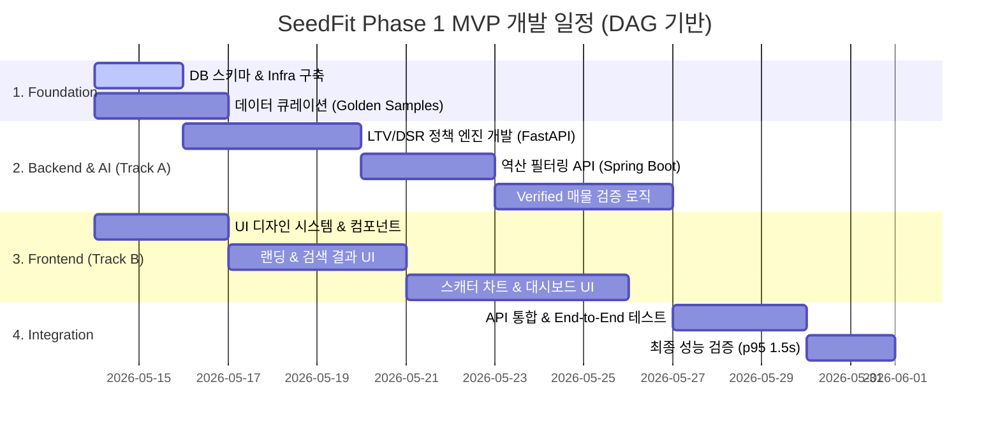

# SeedFit 프로젝트 DAG 기반 병렬 작업 일정 (Gantt)

본 문서는 씨드핏 프로젝트의 개발 효율성을 극대화하기 위해 병렬 작업이 가능한 구조(DAG)로 설계된 일정표입니다.

---

## 🏗️ WBS (Work Breakdown Structure)

| WBS ID | 작업명 | 기간 | 선행 작업 | 병렬 가능 여부 |
|:---:|:---|:---:|:---|:---:|
| **1.0** | **Foundation & Data** | | | |
| 1.1 | DB 스키마 설계 및 인프라 구축 | 2d | - | ⬜ |
| 1.2 | 마스터 데이터 큐레이션 | 3d | - | ✅ (1.1과 병렬) |
| **2.0** | **Backend & AI Engine** | | | |
| 2.1 | LTV/DSR 정책 엔진 개발 | 4d | 1.1 | ✅ (3.1과 병렬) |
| 2.2 | 역산 필터링 API 구현 | 3d | 2.1 | ⬜ |
| 2.3 | Verified 매물 검증 로직 | 4d | 1.2, 2.2 | ⬜ |
| **3.0** | **Frontend Development** | | | |
| 3.1 | UI 컴포넌트 시스템 구축 | 3d | - | ✅ (1.1 병렬) |
| 3.2 | 랜딩 & 검색 결과 UI | 4d | 3.1 | ✅ (2.1 병렬) |
| 3.3 | 스캐터 차트 & 대시보드 UI | 5d | 3.2 | ✅ (2.2 병렬) |
| **4.0** | **Integration & QA** | | | |
| 4.1 | API 통합 및 통합 테스트 | 3d | 2.3, 3.3 | ⬜ |
| 4.2 | 최종 성능 검증 및 배포 | 2d | 4.1 | ⬜ |

---

## 📊 Gantt Chart (Mermaid)

---

## 💡 개발 전략
1.  **초기 트랙 분리**: 1.1, 1.2, 3.1을 동시에 시작하여 기초 공사 시간을 단축합니다.
2.  **Mock API 활용**: 백엔드 API(2.2)가 완성되기 전까지 프론트엔드는 명세서 기반 Mock 데이터를 활용하여 3.2, 3.3 작업을 진행합니다.
3.  **데이터 SSOT**: 모든 데이터 연동은 `docs/golden_samples.csv`를 기준으로 자동화 스크립트를 통해 동기화합니다.
