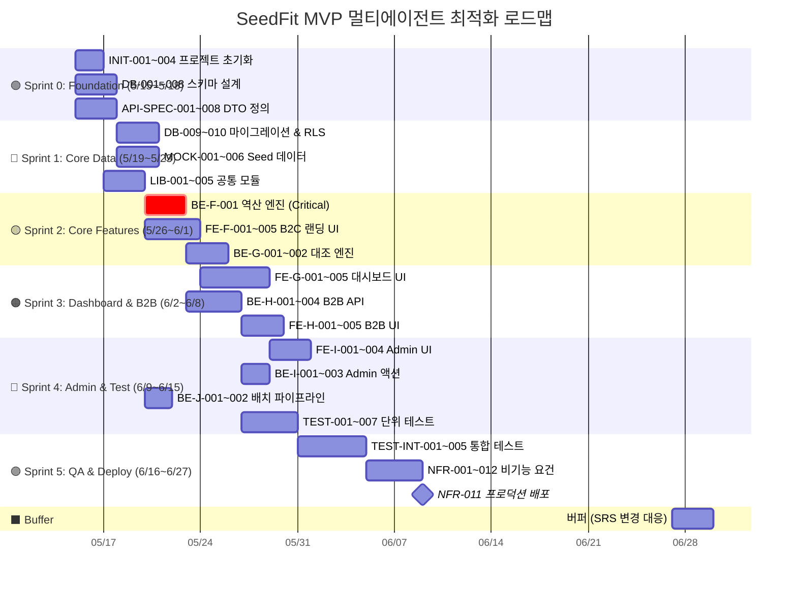

# SeedFit GitHub Project 로드맵 분석 및 최적화 제안

> **분석 대상**: https://github.com/users/luca-prop/projects/2/views/2
> **분석 일시**: 2026-05-15
> **총 이슈**: 85~89개 (TASK 명세서 기준 89개)

---

## 1️⃣ 문제: 왜 85개 이슈가 동일 시점에 몰려 있는가?

### 근본 원인

[sync_github_project.py](file:///c:/Users/82104/.gemini/antigravity/playground/SeedFit-project-root/sync_github_project.py)의 일정 배정 로직이 원인입니다:

```python
# Line 107: "4 tasks per day" 압축 스케줄
start_date = datetime.date.today()  # 모두 동일 시작일

for i, task in enumerate(tasks):
    day_offset = i // 4  # 4개씩 동일 날짜 배정
    task_date = start_date + datetime.timedelta(days=day_offset)
    
    # Start date와 Target date를 동일 값으로 설정
    update_item_field(item_id, fields["Start date"], date_str)
    update_item_field(item_id, fields["Target date"], date_str)
```

**문제점 3가지:**
1. **의존성 무시**: 선행 태스크(dependencies)를 전혀 고려하지 않고 단순히 `i // 4`로 배분
2. **Start = End**: 시작일과 종료일이 동일해서 로드맵 뷰에서 모든 이슈가 점(dot)으로 표시됨
3. **복잡도 무시**: L(저)/M(중)/H(고) 복잡도를 반영하지 않아 H 태스크도 1일로 설정

### 결과
89개 이슈가 약 22일(89÷4)에 걸쳐 분산되어야 하지만, Start/End가 동일해서 로드맵 Gantt에서 **모두 같은 두께의 점**으로 보이고, 의존성 화살표도 없어 순서가 불명확합니다.

---

## 🔧 해결안: 멀티에이전트 병렬 최적화 DAG 기반 Sprint 계획

### 설계 원칙
- **3-Agent 병렬 트랙**: Frontend / Backend / Data&Infra를 동시 진행
- **의존성 존중**: TASK 명세서의 선행 태스크를 DAG(방향성 비순환 그래프)로 반영
- **복잡도 반영**: L=1일, M=2일, H=3일 기준

### 제안 Sprint 일정 (6월 30일 종료 기준, 약 6.5주)



### 에이전트별 병렬 작업 맵

| 기간 | 🤖 Agent A (Frontend) | 🤖 Agent B (Backend) | 🤖 Agent C (Data/Infra) |
|:---:|:---|:---|:---|
| **W1** 5/15~18 | INIT-002 라우트 구조 | INIT-001 프로젝트 세팅 | API-SPEC-001~008 DTO 정의 |
| **W2** 5/19~23 | LIB-003,004 Guard/Masking | DB-009~010 마이그레이션 | MOCK-001~006 Seed 데이터 |
| **W3** 5/26~30 | FE-F-001~005 랜딩 UI | BE-F-001 역산 엔진 ⭐ | LIB-001,002 LTV/Tax 모듈 |
| **W4** 6/2~6 | FE-G-001~005 대시보드 | BE-G-001~002 대조 엔진 | BE-J-001~002 배치 Cron |
| **W5** 6/9~13 | FE-H-001~005 B2B UI | BE-H-001~004 매물 API | BE-I-001~003 Admin 액션 |
| **W6** 6/16~20 | FE-I-001~004 Admin UI | TEST-001~007 단위 테스트 | NFR-004~006 보안 설정 |
| **W7** 6/23~27 | NFR-007~008 모니터링 | TEST-INT-001~005 통합 | NFR-011~012 배포 |

> [!IMPORTANT]
> **Critical Path**: `INIT-001 → DB-001~009 → LIB-001+002 → BE-F-001 → BE-G-001 → TEST-005 → TEST-INT-002 → NFR-011`
> 이 경로의 지연은 전체 일정에 직접 영향을 줍니다.

---

## 2️⃣ 문제: 이슈에 Labels가 없음

### 원인

`sync_github_project.py` 스크립트에 `--label` 옵션이 없습니다:

```python
# 현재 코드 (Label 없음)
issue_url = run_cmd(f'gh issue create --repo {REPO} --title "{title}" --body-file temp_issue_body.md')
```

### 제안 Label 체계

| Label | 색상 | 용도 | 적용 이슈 예시 |
|:---|:---:|:---|:---|
| `epic:foundation` | 🟢 #0E8A16 | Epic A~D (Step 1) | INIT-*, DB-*, API-SPEC-*, MOCK-* |
| `epic:feature` | 🔵 #1D76DB | Epic E~J (Step 2) | LIB-*, FE-*, BE-* |
| `epic:test` | 🟡 #FBCA04 | Epic K~L (Step 3) | TEST-*, TEST-INT-* |
| `epic:nfr` | 🟠 #D93F0B | Epic M~P (Step 4) | NFR-* |
| `track:frontend` | 🟣 #5319E7 | FE 에이전트 담당 | FE-F-*, FE-G-*, FE-H-*, FE-I-* |
| `track:backend` | 🔴 #B60205 | BE 에이전트 담당 | BE-F-*, BE-G-*, BE-H-*, BE-I-*, BE-J-* |
| `track:data` | ⚫ #333333 | Data/Infra 에이전트 담당 | DB-*, MOCK-*, NFR-* |
| `complexity:L` | ⬜ #E4E669 | 복잡도 Low (1일) | - |
| `complexity:M` | 🟧 #F9A825 | 복잡도 Medium (2일) | - |
| `complexity:H` | 🟥 #D32F2F | 복잡도 High (3일) | - |
| `priority:critical-path` | ❗ #FF0000 | Critical Path 이슈 | INIT-001, DB-009, BE-F-001, BE-G-001 |
| `sprint:0` ~ `sprint:5` | 다양 | Sprint 소속 | - |

### 적용 스크립트 (수정 제안)

기존 `sync_github_project.py`를 수정하여 Label을 자동 배정하려면:

```python
def get_labels(task):
    labels = []
    tid = task['id']
    
    # Epic 기반 Label
    if tid.startswith(('INIT', 'DB', 'API-SPEC', 'MOCK')):
        labels.append('epic:foundation')
    elif tid.startswith(('LIB', 'FE', 'BE')):
        labels.append('epic:feature')
    elif tid.startswith('TEST'):
        labels.append('epic:test')
    elif tid.startswith('NFR'):
        labels.append('epic:nfr')
    
    # Track 기반 Label
    if tid.startswith('FE'):
        labels.append('track:frontend')
    elif tid.startswith('BE') or tid.startswith('LIB'):
        labels.append('track:backend')
    elif tid.startswith(('DB', 'MOCK', 'NFR', 'INIT')):
        labels.append('track:data')
    
    # 복잡도 Label
    complexity_map = {'L': 'complexity:L', 'M': 'complexity:M', 'H': 'complexity:H'}
    labels.append(complexity_map.get(task['complexity'], 'complexity:M'))
    
    return labels

# gh issue create에 --label 추가
label_str = ','.join(get_labels(task))
issue_url = run_cmd(
    f'gh issue create --repo {REPO} --title "{title}" '
    f'--body-file temp_issue_body.md --label "{label_str}"'
)
```

> [!WARNING]
> Label을 먼저 GitHub 레포에 생성해야 합니다. `gh label create` 명령으로 일괄 생성 필요.

---

## 3️⃣ 전략 판단: SRS 변동 속에서 로드맵 실행을 시작해야 하는가?

### 결론: ✅ **Yes, 지금 시작하되 "Frozen Zone" 전략을 적용**

### 근거

| 요소 | 분석 |
|:---|:---|
| **남은 기간** | 약 6.5주 (5/15 ~ 6/30) |
| **총 태스크** | 89개 (3-Agent 병렬 시 주당 ~14개 소화 필요) |
| **SRS 변동 현황** | v1.0 → v1.1 → v1.2로 점진적 확장 (기능⑤ 스캐터 차트 추가, REQ-FUNC-014-1~3 프로토타입 피드백 반영) |
| **변동 패턴** | **핵심 도메인(①②③④)은 안정**, 변동은 주로 UI 세부사항 및 신규 기능(⑤)에 집중 |

### "Frozen Zone" 전략

```
┌─────────────────────────────────────────────────┐
│  🧊 FROZEN (Sprint 0~2, 즉시 착수)              │
│                                                 │
│  ✅ INIT-001~004  프로젝트 초기화                 │
│  ✅ DB-001~010    스키마 & 마이그레이션            │
│  ✅ API-SPEC-*    DTO/에러코드 계약               │
│  ✅ MOCK-001~006  Seed 데이터                    │
│  ✅ LIB-001~005   공통 모듈                      │
│  ✅ BE-F-001      역산 엔진 (핵심 비즈니스 로직)    │
│                                                 │
│  → 이 영역은 SRS 1.0부터 변동 없음.               │
│  → 즉시 착수해도 재작업 리스크 ≈ 0%              │
└─────────────────────────────────────────────────┘

┌─────────────────────────────────────────────────┐
│  🟡 FLEX (Sprint 3~4, 착수하되 변경 수용)         │
│                                                 │
│  ⚠️ FE-G-*       대시보드 UI (프로토타입 피드백)   │
│  ⚠️ FE-H-*       B2B UI                        │
│  ⚠️ FE-SC-*      스캐터 차트 (v1.2 신규 추가)    │
│                                                 │
│  → UI 세부사항은 변경 가능성 있음                  │
│  → 컴포넌트 단위로 모듈화하여 교체 비용 최소화      │
└─────────────────────────────────────────────────┘

┌─────────────────────────────────────────────────┐
│  ❄️ DEFERRED (Sprint 5, 최종 확정 후 착수)        │
│                                                 │
│  ⏸️ NFR-007~008  Amplitude 이벤트 (퍼널 확정 후)  │
│  ⏸️ NFR-011      프로덕션 배포 (전체 검증 후)      │
│  ⏸️ TEST-INT-*   통합 테스트 (API 확정 후)        │
│                                                 │
│  → SRS 변동이 가장 크게 영향주는 영역              │
│  → 핵심 기능 완성 후 확정된 스펙으로 진행           │
└─────────────────────────────────────────────────┘
```

### 실행 액션 플랜

| 우선순위 | 액션 | 도구 | 소요 시간 |
|:---:|:---|:---:|:---:|
| 1 | GitHub Label 일괄 생성 | `gh label create` | 5분 |
| 2 | 기존 이슈에 Label 일괄 배정 | `gh issue edit --add-label` | 15분 |
| 3 | 로드맵 일정 업데이트 (Start/End 분리) | `gh project item-edit` | 20분 |
| 4 | Sprint 0 이슈를 "In Progress"로 이동 | GitHub Project Board | 2분 |

---

## 📊 요약 비교

| 항목 | 현재 (As-Is) | 제안 (To-Be) |
|:---|:---|:---|
| **일정 배분** | 4개/일 균등 배분, 의존성 무시 | DAG 기반 의존성 & 복잡도 반영 |
| **Labels** | 없음 | 4차원 (Epic / Track / Complexity / Sprint) |
| **병렬화** | 단일 트랙 (순차) | 3-Agent 트랙 (FE/BE/Data) |
| **SRS 변동 대응** | 계획 없음 | Frozen Zone 전략 + 3일 버퍼 |
| **예상 완료** | 불명확 | 6/27 (3일 버퍼 포함 6/30) |
| **Critical Path** | 미식별 | 8개 태스크 식별 및 표시 |

> [!TIP]
> **즉시 실행 가능 제안**: Sprint 0 (INIT + DB + API-SPEC)은 SRS 변동 영향이 0%입니다. 오늘 바로 시작하시면 됩니다.
